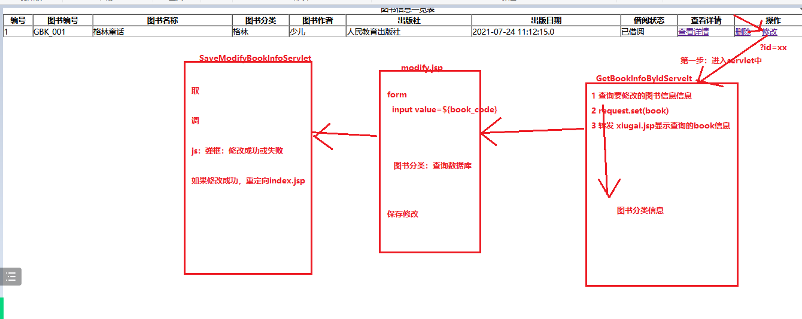

# 课程回顾

## 1 javaWeb实现CRUD实现，步骤具体有

```html
1.分析实现需求，底层使用SQL语句
新增：insert 表 values(?,?,?,?)
2.表--->domain包实体类
 2-1 属性名和查询SQL语句查询结果集列名不一致
  查询SQL：select book_code code
  实体类：book_Code

  提供有参构造方法：
  没有手动添加无参构造方法
3.dao层：JDBC代码
  接口+实现类
4.建议：单元测试，确认dao没有问题
5.service层：
  接口+实现类
6.建议：单元测试，确认service没有问题

7.设计出来，JSP
JSP需要将数据提交Servlet

8.Servlet处理请求：
  取
  调
   response写响应体
  存
  转  
```

# 课程目标

## 1 新增 ==== 掌握

### 扩展：简化数据提交时，在Servlet获取数据代码

###   BeanUtils工具

## 2 修改 ==== 难点

## 3 模糊查询+分页

# 课程实施

## 1 新增

### 1-1 新增业务流程


### 1-2 进入新增jsp页面的代码


#### daoの图书分类查询

```java
package cn.kgc.dao.impl;

import cn.kgc.dao.BookTypeDao;
import cn.kgc.domain.BookType;
import cn.kgc.util.JDBCUtil;
import org.apache.commons.dbutils.QueryRunner;
import org.apache.commons.dbutils.handlers.BeanListHandler;

import java.sql.SQLException;
import java.util.List;

/**
 * @Author: lc
 * @Date: 2022/5/20
 * @Description: cn.kgc.dao.impl
 * @Version: 1.0
 */
public class BookTypeDaoImpl  implements BookTypeDao {
	private QueryRunner qr=new QueryRunner(JDBCUtil.datasource);
	@Override
	public List<BookType> selectAll() {
		try {
			return qr.query("select id,type_name from book_type",
					new BeanListHandler<>(BookType.class));
		} catch (SQLException e) {
			throw new RuntimeException(e);
		}
	}
}
```

#### serviceの获取所有的图书分类

```java
package cn.kgc.service.impl;

import cn.kgc.dao.BookTypeDao;
import cn.kgc.dao.impl.BookTypeDaoImpl;
import cn.kgc.domain.BookType;
import cn.kgc.service.BookTypeService;

import java.util.List;

/**
 * @Author: lc
 * @Date: 2022/5/20
 * @Description: cn.kgc.service.impl
 * @Version: 1.0
 */
public class BookTypeServiceImpl implements BookTypeService {
	private BookTypeDao dao=new BookTypeDaoImpl();
	@Override
	public List<BookType> getAllBookTypes() {
		return dao.selectAll();
	}
}
```

#### Servletの获取所有的图书分类转发给新增jsp显示

```java
package cn.kgc.controller; /**
 * @Author: lc
 * @Date: 2022/5/20
 * @Description: ${PACKAGE_NAME}
 * @Version: 1.0
 */

import cn.kgc.domain.BookType;
import cn.kgc.service.impl.BookTypeServiceImpl;

import javax.servlet.*;
import javax.servlet.http.*;
import javax.servlet.annotation.*;
import java.io.IOException;
import java.util.List;

@WebServlet("/GetBookTypesServlet")
public class GetBookTypesServlet extends HttpServlet {
	@Override
	protected void doGet(HttpServletRequest request, HttpServletResponse response) throws ServletException, IOException {
		//取  略

		//调 查询所有的图书分类的信息
		//实现jsp上面，外键约束的列值来源于主表的主键数据
		List<BookType> allBookTypes = new BookTypeServiceImpl().getAllBookTypes();
		//存
		request.setAttribute("bookTypes", allBookTypes);
		//转
		request.getRequestDispatcher("/addBook.jsp").forward(request,response);
	}

	@Override
	protected void doPost(HttpServletRequest request, HttpServletResponse response) throws ServletException, IOException {
		doGet(request, response);
	}
}
```

#### addBook.jspの显示所有的图书分类

```jsp
<%@ page contentType="text/html;charset=UTF-8" language="java" %>
<%--jstl依赖--%>
<%@taglib prefix="c" uri="http://java.sun.com/jsp/jstl/core" %>
<html>
<head>
    <title>图书借阅系统</title>
</head>
<body>
<%--
新增、修改通常表单提交，提交方式：post方式
--%>
<form action="${pageContext.servletContext.contextPath}/AddBookInfoServlet" method="post">
    <table align="center" border="1px" cellspacing="0px" width="800px">
        <tr>
            <td>
                <h3 align="center">图书借阅系统</h3>
                <table border="1px" cellspacing="1px" width="800px">
                    <tr>
                        <th>图书编号</th>
                        <td>
                            <%--
                            EL{}没有NULL，
                            --%>
                            <input type="text" name="book_code"/>
                        </td>
                    </tr>
                    <tr>
                        <th>图书名称</th>
                        <td>
                            <input type="text" name="book_name"/>
                        </td>
                    </tr>
                    <tr>
                        <th>图书分类</th>
                        <td>
                            <select name="book_type">
                                <option value="">===请选择===</option>
                            <%--   获取Request域中的图书分类集合 --%>
                                <c:forEach var="type" items="${bookTypes}">
                                    <option value="${type.id}">${type.type_name}</option>
                                </c:forEach>
                            </select>
                        </td>
                    </tr>
                    <tr>
                        <th>作者</th>
                        <td>
                            <input type="text" name="book_author"/>
                        </td>
                    </tr>
                    <tr>
                        <th>出版社</th>
                        <td>
                            <input type="text" name="publish_press"/>
                        </td>
                    </tr>
                    <tr>
                        <th>出版时间</th>
                        <td>
                            <%--
                                date是表单项，提供日期选择的标签
                            --%>
                            <input type="date" name="publish_date"/>
                        </td>
                    </tr>
                    <tr>
                        <th>借阅状态</th>
                        <td>
                            <select name="is_borrow">
                                <option value="">===请选择===</option>
                                <option value="false">未借阅</option>
                                <option value="true">已借阅</option>
                            </select>
                        </td>
                    </tr>
                    <tr>
                        <td colspan="2" align="center">
                            <input type="submit" value="保存图书" />
                            <input type="reset" value="取消" />
                        </td>
                    </tr>
                </table>
            </td>
        </tr>
    </table>
</form>
</body>
</html>
```

### 1-3 实现新增功能的代码

#### daoの执行insert语句

```java
@Override
	public int insert(BookInfo book) {
		StringBuilder sb=new StringBuilder();
		sb.append("insert book_info  values ");
		sb.append(" (NULL,?,?,?,?,?,?,?)");//主键：null默认填入自增长  手动填入主键
		try {
			return qr.update(sb.toString(),
					book.getBook_code(),
					book.getBook_name(),
					book.getBook_type(),
					book.getBook_author(),
					book.getPublish_press(),
					book.getPublish_date(),
					//isIs_borrow getter针对boolean列自动生成的方法命名规范
					book.isIs_borrow());
		} catch (SQLException e) {
			throw new RuntimeException(e);
		}
	}
```

#### serviceの实现新增功能

```java
	@Override
	public boolean add(BookInfo book) {
		return dao.insert(book)==1;
	}
```

#### Servletの获取表单数据，执行insert功能

```java
package cn.kgc.controller; /**
 * @Author: lc
 * @Date: 2022/5/20
 * @Description: ${PACKAGE_NAME}
 * @Version: 1.0
 */

import cn.kgc.domain.BookInfo;
import cn.kgc.service.impl.BookInfoServiceImpl;

import javax.servlet.ServletException;
import javax.servlet.annotation.WebServlet;
import javax.servlet.http.HttpServlet;
import javax.servlet.http.HttpServletRequest;
import javax.servlet.http.HttpServletResponse;
import java.io.IOException;
import java.io.PrintWriter;
import java.text.SimpleDateFormat;
import java.util.Date;

@WebServlet("/AddBookInfoServlet")
public class AddBookInfoServlet extends HttpServlet {
	@Override
	protected void doGet(HttpServletRequest request, HttpServletResponse response) throws ServletException, IOException {
		request.setCharacterEncoding("utf-8");
		response.setContentType("text/html;charset=utf-8");
		//取
		String book_code = request.getParameter("book_code");
		String book_name = request.getParameter("book_name");
		String book_typeStr = request.getParameter("book_type");
		String book_author = request.getParameter("book_author");
		String publish_press = request.getParameter("publish_press");
		String publish_dateStr = request.getParameter("publish_date");
		String is_borrowStr = request.getParameter("is_borrow");

		//String-->其他类型
		Integer book_type = null;
		try {
			book_type = Integer.valueOf(book_typeStr);
			//Integer.parseInt(book_typeStr);
		} catch (Exception e) {
			//空着
		}

		Date publish_date = null;
		try {
			SimpleDateFormat sdf=new SimpleDateFormat("yyyy/MM/dd");
			publish_date = sdf.parse(publish_dateStr);
		} catch (Exception e) {

		}
		Boolean is_borrow=null;
		try {
			is_borrow = Boolean.valueOf(is_borrowStr);
		} catch (Exception e) {

		}
		// 调
		BookInfo book=new BookInfo();

		book.setBook_code(book_code);
		book.setBook_name(book_name);
		book.setPublish_press(publish_press);
		book.setBook_author(book_author);
		book.setBook_type(book_type);
		book.setPublish_date(publish_date);
		book.setIs_borrow(is_borrow);

		boolean bool = new BookInfoServiceImpl().add(book);

		//响应体的方式，alert()
		PrintWriter writer = response.getWriter();
		writer.print("<script type='text/javascript'>alert('"+(bool?"添加成功":"添加失败")+"');</script>");
		if(bool){
			//重定向 302
			//getServletContext().getContextPath()获取服务器上发布项目的名称
			//response.sendRedirect(getServletContext().getContextPath()+"/index.jsp");
			writer.print("<script type='text/javascript'>location.href='"+getServletContext().getContextPath()+"/index.jsp';</script>");
		}
	}

	@Override
	protected void doPost(HttpServletRequest request, HttpServletResponse response) throws ServletException, IOException {
		doGet(request, response);
	}
}
```

## 扩展：表单数据的快速封装

### 日期转换器

```java
//针对日期格式，日期格式转换器
DateConverter converter=new DateConverter();
converter.setPatterns(new String[]{"yyyy-MM-dd","yyyyMMdd","yyyy年MM月dd日","yyyy/MM/dd"});
ConvertUtils.register(converter,java.util.Date.class);

BeanUtils.populate(book,request.getParameterMap());
```

### 实现form数据快速封装为Bean对象

```java
BookInfo book=new BookInfo();
//亲力亲为赋值，借助BeanUtils对象，简化亲力亲为赋值的过程
try {
    //针对日期格式，日期格式转换器
    DateConverter converter=new DateConverter();
    converter.setPatterns(new String[]{"yyyy-MM-dd","yyyyMMdd","yyyy年MM月dd日","yyyy/MM/dd"});
    ConvertUtils.register(converter,java.util.Date.class);

    BeanUtils.populate(book,request.getParameterMap());
    System.out.println(book);
} catch (Exception e) {
    throw new RuntimeException(e);
}
```

## 2 修改

### 2-1 修改实现流程



### 2-2 实现修改图书的数据显示

#### daoの根据主键查询要修改的图书信息

```java
	@Override
	public BookInfo selectByPkId(Integer id) {
		StringBuilder sb=new StringBuilder();
		sb.append("SELECT book_info.book_id id,book_info.book_code,");
		sb.append("book_info.book_name,book_info.book_type,");
		sb.append("book_info.book_author,book_info.publish_press,");
		sb.append("book_info.publish_date,book_info.is_borrow ");
		sb.append(" FROM book_info ");
		sb.append(" where book_info.book_id=?");
		try {
			return qr.query(sb.toString(),new BeanHandler<>(BookInfo.class),id);
		} catch (SQLException e) {
			throw new RuntimeException(e);
		}
	}
```

#### serviceの获取修改的图书信息

```java
	package cn.kgc.service.impl;
	
	import cn.kgc.dao.BookInfoDao;
	import cn.kgc.dao.impl.BookInfoDaoImpl;
	import cn.kgc.domain.BookInfo;
	import cn.kgc.service.BookInfoService;
	
	import java.util.List;
	
	/**
	 * @Author: lc
	 * @Date: 2022/5/17
	 * @Description: cn.kgc.service.impl
	 * @Version: 1.0
	 */
	public class BookInfoServiceImpl implements BookInfoService {
		private BookInfoDao dao=new BookInfoDaoImpl();
	
		@Override
		public BookInfo findBookInfoBy(Integer id) {
			return dao.selectByPkId(id);
		}
	}

```

#### Servletの获取图书分类、要修改的图书信息存入域对象，转发给修改jsp显示

```java
package cn.kgc.controller; /**
 * @Author: lc
 * @Date: 2022/5/20
 * @Description: ${PACKAGE_NAME}
 * @Version: 1.0
 */

import cn.kgc.domain.BookInfo;
import cn.kgc.domain.BookType;
import cn.kgc.service.impl.BookInfoServiceImpl;
import cn.kgc.service.impl.BookTypeServiceImpl;

import javax.servlet.*;
import javax.servlet.http.*;
import javax.servlet.annotation.*;
import java.io.IOException;
import java.util.List;

@WebServlet("/GetModifyBookInfoServlet")
public class GetModifyBookInfoServlet extends HttpServlet {
	@Override
	protected void doGet(HttpServletRequest request, HttpServletResponse response) throws ServletException, IOException {
        //取
        String idStr = request.getParameter("id");
        //套路：
		Integer id=null;
		try {
			id = Integer.valueOf(idStr);
		} catch (Exception e) {
		}
		//调用
		//1-1 获取要显示图书信息
		BookInfo book = new BookInfoServiceImpl().findBookInfoBy(id);
		//1-2 获取图书分类信息
		List<BookType> allBookTypes = new BookTypeServiceImpl().getAllBookTypes();

		//存
		request.setAttribute("book",book);
		request.setAttribute("types",allBookTypes);

		//转发
		request.getRequestDispatcher("/modify.jsp").forward(request,response);
	}

	@Override
	protected void doPost(HttpServletRequest request, HttpServletResponse response) throws ServletException, IOException {
		doGet(request, response);
	}
}
```

#### modify.jspの显示要修改的图书信息

```jsp
<%@ page contentType="text/html;charset=UTF-8" language="java" %>
<%@taglib prefix="c" uri="http://java.sun.com/jsp/jstl/core"%>
<html>
<head>
    <meta charset="UTF-8">
    <title>修改图书信息</title>
</head>

<body>
<form action="${pageContext.servletContext.contextPath}/SaveModifyBookInfoServlet" method="post">
    <%--隐藏域--%>
    <input type="hidden" value="${book.id}" name="id">
    <table align="center" border="1px" cellspacing="0px" width="800px">
        <tr>
            <td>
                <h3 align="center">图书借阅系统</h3>
                <table border="1px" cellspacing="1px" width="800px">
                    <tr>
                        <th>图书编号</th>
                        <td>
                            <input type="text" name="book_code" value="${book.book_code}" />
                        </td>
                    </tr>
                    <tr>
                        <th>图书名称</th>
                        <td>
                            <input type="text" name="book_name" value="${book.book_name}" />
                        </td>
                    </tr>
                    <tr>
                        <th>图书分类</th>
                        <td>
                            <select name="book_type">
                                <option value="">===请选择===</option>
                                <%--
                                1.循环，将所有的图书分类显示
                                2.根据修改的图书分类，设置默认的选中项
                                --%>
                                <c:forEach items="${types}" var="type">
                                    <option value="${type.id}"
                                      <c:if test="${book.book_type==type.id}">
                                            selected
                                      </c:if>
                                    >${type.type_name}</option>
                                </c:forEach>
                            </select>
                        </td>
                    </tr>
                    <tr>
                        <th>作者</th>
                        <td>
                            <input type="text" name="book_author" value="${book.book_author}"/>
                        </td>
                    </tr>
                    <tr>
                        <th>出版社</th>
                        <td>
                            <input type="text" name="publish_press" value="${book.publish_press}"/>
                        </td>
                    </tr>
                    <tr>
                        <th>出版时间</th>
                        <td>
                            <input type="date" name="publish_date" value="${book.publish_date}"/>
                        </td>
                    </tr>
                    <tr>
                        <th>借阅状态</th>
                        <td>
                            <select name="is_borrow">
                                <option value="">===请选择===</option>
                                <option value="false"
                                    <c:if test="${book.is_borrow==false}">
                                        selected
                                    </c:if>
                                >未借阅</option>
                                <option value="true"
                                 <c:if test="${book.is_borrow==true}">
                                    selected
                                </c:if>
                                >已借阅</option>
                            </select>
                        </td>
                    </tr>
                    <tr>
                        <td colspan="2" align="center">
                            <input type="submit" value="保存修改" />
                            <input type="reset" value="取消"/>
                        </td>
                    </tr>
                </table>
            </td>
        </tr>
    </table>
</form>
</body>
</html>

```

### 2-3 实现修改保存数据

#### daoの根据主键修改图书信息

```java
@Override
	public int update(BookInfo book) {
		StringBuilder sb=new StringBuilder();
		sb.append("update book_info set ");
		sb.append(" book_code=?,book_name=?,book_type=?,book_author=?,");
		sb.append(" publish_press=?,publish_date=?,is_borrow=? where book_id=?");
		try {
			return qr.update(sb.toString(),book.getBook_code(),
					book.getBook_name(),
					book.getBook_type(),
					book.getBook_author(),
					book.getPublish_press(),
					book.getPublish_date(),
					//isIs_borrow getter针对boolean列自动生成的方法命名规范
					book.isIs_borrow(),
					book.getId());
		} catch (SQLException e) {
			throw new RuntimeException(e);
		}
	}
```

#### serviceの实现图书修改

```java
	package cn.kgc.service.impl;
	
	import cn.kgc.dao.BookInfoDao;
	import cn.kgc.dao.impl.BookInfoDaoImpl;
	import cn.kgc.domain.BookInfo;
	import cn.kgc.service.BookInfoService;
	
	import java.util.List;
	
	/**
	 * @Author: lc
	 * @Date: 2022/5/17
	 * @Description: cn.kgc.service.impl
	 * @Version: 1.0
	 */
	public class BookInfoServiceImpl implements BookInfoService {
		private BookInfoDao dao=new BookInfoDaoImpl();
	
		@Override
		public boolean modify(BookInfo book) {
			return dao.update(book)==1;
		}
	}

```

#### modify.jsp页面设计の隐藏域的设计

```jsp
<%@ page contentType="text/html;charset=UTF-8" language="java" %>
<%@taglib prefix="c" uri="http://java.sun.com/jsp/jstl/core"%>
<html>
<head>
    <meta charset="UTF-8">
    <title>修改图书信息</title>
</head>

<body>
<form action="${pageContext.servletContext.contextPath}/SaveModifyBookInfoServlet" method="post">
    <%--隐藏域--%>
    <input type="hidden" value="${book.id}" name="id">
    <table align="center" border="1px" cellspacing="0px" width="800px">
        <tr>
            <td>
                <h3 align="center">图书借阅系统</h3>
                <table border="1px" cellspacing="1px" width="800px">
                    <tr>
                        <th>图书编号</th>
                        <td>
                            <input type="text" name="book_code" value="${book.book_code}" />
                        </td>
                    </tr>
                    <tr>
                        <th>图书名称</th>
                        <td>
                            <input type="text" name="book_name" value="${book.book_name}" />
                        </td>
                    </tr>
                    <tr>
                        <th>图书分类</th>
                        <td>
                            <select name="book_type">
                                <option value="">===请选择===</option>
                                <%--
                                1.循环，将所有的图书分类显示
                                2.根据修改的图书分类，设置默认的选中项
                                --%>
                                <c:forEach items="${types}" var="type">
                                    <option value="${type.id}"
                                      <c:if test="${book.book_type==type.id}">
                                            selected
                                      </c:if>
                                    >${type.type_name}</option>
                                </c:forEach>
                            </select>
                        </td>
                    </tr>
                    <tr>
                        <th>作者</th>
                        <td>
                            <input type="text" name="book_author" value="${book.book_author}"/>
                        </td>
                    </tr>
                    <tr>
                        <th>出版社</th>
                        <td>
                            <input type="text" name="publish_press" value="${book.publish_press}"/>
                        </td>
                    </tr>
                    <tr>
                        <th>出版时间</th>
                        <td>
                            <input type="date" name="publish_date" value="${book.publish_date}"/>
                        </td>
                    </tr>
                    <tr>
                        <th>借阅状态</th>
                        <td>
                            <select name="is_borrow">
                                <option value="">===请选择===</option>
                                <option value="false"
                                    <c:if test="${book.is_borrow==false}">
                                        selected
                                    </c:if>
                                >未借阅</option>
                                <option value="true"
                                 <c:if test="${book.is_borrow==true}">
                                    selected
                                </c:if>
                                >已借阅</option>
                            </select>
                        </td>
                    </tr>
                    <tr>
                        <td colspan="2" align="center">
                            <input type="submit" value="保存修改" />
                            <input type="reset" value="取消"/>
                        </td>
                    </tr>
                </table>
            </td>
        </tr>
    </table>
</form>
</body>
</html>
```

#### Servletの获取修改后的图书信息并修改

```java
package cn.kgc.controller; /**
 * @Author: lc
 * @Date: 2022/5/20
 * @Description: ${PACKAGE_NAME}
 * @Version: 1.0
 */

import cn.kgc.domain.BookInfo;
import cn.kgc.service.impl.BookInfoServiceImpl;
import org.apache.commons.beanutils.BeanUtils;
import org.apache.commons.beanutils.ConvertUtils;
import org.apache.commons.beanutils.converters.DateConverter;

import javax.servlet.ServletException;
import javax.servlet.annotation.WebServlet;
import javax.servlet.http.HttpServlet;
import javax.servlet.http.HttpServletRequest;
import javax.servlet.http.HttpServletResponse;
import java.io.IOException;
import java.io.PrintWriter;

@WebServlet("/SaveModifyBookInfoServlet")
public class SaveModifyBookInfoServlet extends HttpServlet {
	@Override
	protected void doGet(HttpServletRequest request, HttpServletResponse response) throws ServletException, IOException {
        request.setCharacterEncoding("utf-8");
        response.setContentType("text/html;charset=utf-8");
        //扩展：
        BookInfo book=new BookInfo();
        //亲力亲为赋值，借助BeanUtils对象，简化亲力亲为赋值的过程
        try {
            //针对日期格式，日期格式转换器
            DateConverter converter=new DateConverter();
            converter.setPatterns(new String[]{"yyyy-MM-dd","MM-dd-yyyy","yyyyMMdd","yyyy年MM月dd日","yyyy/MM/dd"});
            ConvertUtils.register(converter,java.util.Date.class);

            BeanUtils.populate(book,request.getParameterMap());
            System.out.println(book);
        } catch (Exception e) {
            throw new RuntimeException(e);
        }
        boolean bool= new BookInfoServiceImpl().modify(book);

        //响应体的方式，alert()
        PrintWriter writer = response.getWriter();
        writer.print("<script type='text/javascript'>alert('"+(bool?"修改成功":"修改失败")+"');</script>");
        if(bool){
            //重定向 302
            //getServletContext().getContextPath()获取服务器上发布项目的名称
            //response.sendRedirect(getServletContext().getContextPath()+"/index.jsp");
            writer.print("<script type='text/javascript'>location.href='"+getServletContext().getContextPath()+"/index.jsp';</script>");
        }
	}

	@Override
	protected void doPost(HttpServletRequest request, HttpServletResponse response) throws ServletException, IOException {
		doGet(request, response);
	}
}

```

## 常见异常


# 课程总结

## 1 图书新增功能

## 2 图书修改功能

## 3 BeanUtils.populate()功能


# 课程预习

## 1.Session和Cookie

## 2.文件上传和下载

## 3 监听器和过滤器

## 4 ajax