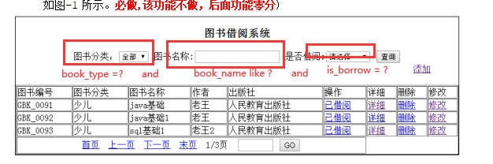
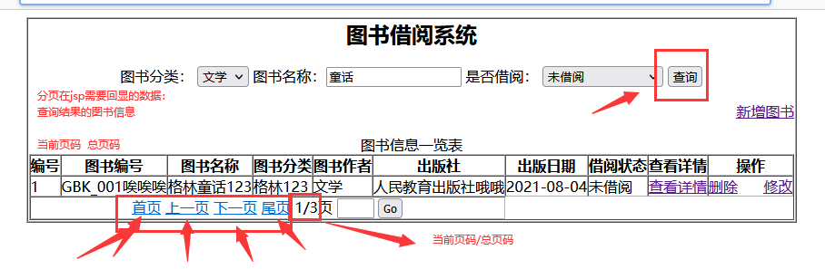
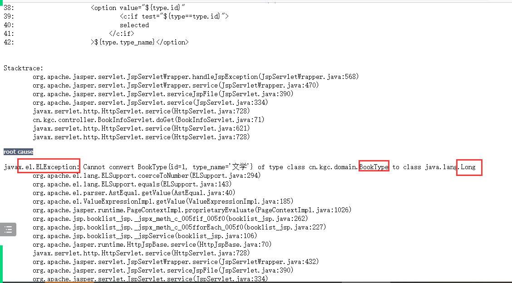

# 课程回顾

## 1 新增业务流程

​	 MVC设计模式：jsp负责数据收集，提交Servlet调用Service层代码处理最终数据库实现

## 2 修改业务流程

​     BeanUtils简化form提交数据后的封装

# 课程目标

## 1 多条件模糊查询

## 2 分页

# 课程实施

## 1 多条件模糊查询



### 1-1 domain+dao+Service

```java
// sql需求
SELECT book_info.*,book_type.type_name,book_type.id
FROM book_info LEFT JOIN book_type 
ON book_info.book_type=book_type.id
-- 思考：每次用户在网页上面，都会一次性提供三个条件吗？
-- 举例：只给了图书名称一部分核心词语
WHERE 1=1

AND book_info.book_type=?

AND book_info.book_name LIKE ?

AND book_info.is_borrow=?
    
    
```

### 1-2 代码实现

#### daoのBookInfoDaoImpl多条件查询

```java
	@Override
	public List<BookInfo> selectAll(Integer bookType, String bookName, Integer isBorrow) {
		//执行SQL语句
		StringBuilder sb=new StringBuilder();
		sb.append(" SELECT book_info.book_id id,book_info.book_code, ");
		sb.append(" book_info.book_name,book_info.book_type, ");
		sb.append(" book_info.book_author,book_info.publish_press, ");
		sb.append(" book_info.publish_date,book_info.is_borrow, ");
		sb.append(" book_type.type_name FROM book_info ");
		sb.append(" LEFT JOIN book_type ON book_info.book_type=book_type.id ");
		//where 1=1作用：条件的拼接关键字and设置进去
		sb.append(" where 1=1 ");
		//String判断两个值：null ""
		//将所有的？对应的实参，使用集合保存
		List params=new ArrayList();
		if(!Objects.isNull(bookType)){
			sb.append(" AND book_info.book_type=? ");
			params.add(bookType);
		}
		if(!Objects.isNull(bookName)&&!bookName.isEmpty()){
			sb.append(" AND book_info.book_name LIKE ? ");
			params.add("%"+bookName+"%");
		}
		if(!Objects.isNull(isBorrow)){
			sb.append(" AND book_info.is_borrow=? ");
			params.add(isBorrow);
		}
		//qr.query(String 要执行的sql语句，
		// BeanHandler BeanListHandler ScalarHandler 转换的类型，
		// Object... sql语句？对应的实参）
		try {
			return qr.query(sb.toString(),
					new BeanListHandler<>(BookInfo.class),
					// Object... 底层就是数组，所以集合必须转换为数组，底层才能正常解析
					params.toArray());
		} catch (SQLException e) {
			throw new RuntimeException(e);
		}
	}
```

#### serviceのBookInfoServiceImpl多条件模糊查询

```java
@Override
public List<BookInfo> getAll(Integer bookType, String bookName, Integer isBorrow) {
	return dao.selectAll(bookType,bookName,isBorrow);
}
```

#### jspのbooklist.jsp 查询页面的设计

```jsp
<script type="text/javascript">
    function doSearch(){
        //单击查询按钮，向BookInfoServlet发出请求
        //发出请求时，需要带着查询条件过去
        //form走POST   地址栏地址能变，就是发请求统一get
        // window.open();
        //js支持EL
        //定义字符串，保存搜索条件
        var query="bookType="+document.getElementById("type").value;//?应该是用户实际输入的数据
        query+="&bookName="+document.getElementById("book_name").value;
        query+="&isBorrow="+document.getElementById("borrow").value;
        location.href="${pageContext.servletContext.contextPath}/BookInfoServlet?"+query;
        // location.assign();
    }
</script>
<body>
<table border="1px" cellspacing="0px" align="center">
    <tr>
        <td align="center">
            <h2 align="center">图书借阅系统</h2>
            <!--<p align="center">-->
            图书分类：
            <select name="book_type" id="type">
                <option value="">全部</option>
                <%--    从数据库查询的图书分类 --%>
                <c:forEach items="${types}" var="type">
                    <%--  要求：value指定主键  innerText:列值 汉字 --%>
                    <option value="${type.id}">${type.type_name}</option>
                </c:forEach>
            </select>
            图书名称：<input type="text" id="book_name"/>
            是否借阅：
            <select name="is_borrow" id="borrow">
                <option value="">===请选择====</option>
                <option value="1">已借阅
                </option>
                <option value="0">未借阅
                </option>
            </select>
            <%--
            submit和Image 提交表单按钮
            reset 重置按钮
            button 普通按钮
            --%>
            <input type="button" value="查询" id="search" onclick="doSearch()"/>
            //略
```

#### ServletのBookInfoServlet实现查询

```java
package cn.kgc.controller; /**
 * @Author: lc
 * @Date: 2022/5/17
 * @Description: ${PACKAGE_NAME}
 * @Version: 1.0
 */

import cn.kgc.domain.BookInfo;
import cn.kgc.domain.BookType;
import cn.kgc.service.BookInfoService;
import cn.kgc.service.impl.BookInfoServiceImpl;
import cn.kgc.service.impl.BookTypeServiceImpl;

import javax.servlet.ServletException;
import javax.servlet.annotation.WebServlet;
import javax.servlet.http.HttpServlet;
import javax.servlet.http.HttpServletRequest;
import javax.servlet.http.HttpServletResponse;
import java.io.IOException;
import java.util.List;

@WebServlet("/BookInfoServlet")
public class BookInfoServlet extends HttpServlet {
	@Override
	protected void doGet(HttpServletRequest request, HttpServletResponse response) throws ServletException, IOException {
		//请求发送的搜索条件中，图书名称可能是中文，GET必须处理中文
		//tomcat8 9 10针对get没有乱码
        //取 请求体或url地址传输的表单数据？略
		String bookTypeStr = request.getParameter("bookType");//请求没有数据时，bookTypeStr null
		String bookName = request.getParameter("bookName");//bookName null
		//解决get请求乱码问题 trim():去除字符串首尾的无效空格
		if (bookName!=null && !bookName.trim().isEmpty()) {
			bookName=new String(bookName.getBytes("iso8859-1"),"utf-8");
		}
		String isBorrowStr = request.getParameter("isBorrow");

		//类型转换
		Integer bookType=null;
		try {
			//valueOf(null)不能正常转换
			bookType=Integer.valueOf(bookTypeStr);
		} catch (Exception e) {	}

		Integer isBorrow=null;
		try {
			//valueOf(null)不能正常转换
			isBorrow=Integer.valueOf(isBorrowStr);
		} catch (Exception e) {	}
		//调 service层
        BookInfoService service = new BookInfoServiceImpl();
        //思考：查询按钮提交请求，是不是可以使用这个Servlet来处理？？
        List<BookInfo> books = service.getAll(bookType,bookName,isBorrow);
        //查询图书分类信息
		List<BookType> types = new BookTypeServiceImpl().getAllBookTypes();
		//存 共享
        request.setAttribute("list",books);//显示图书信息
        request.setAttribute("types",types);//显示图书分类信息
		//为了实现查询条件的回显，所以要将所有查询条件存入域
		request.setAttribute("type",bookType);
		request.setAttribute("bookName",bookName);
		request.setAttribute("borrow",isBorrow);
        //转
        //jsp本质就是一个servlet
        request.getRequestDispatcher("/booklist.jsp").forward(request,response);
	}

	@Override
	protected void doPost(HttpServletRequest request, HttpServletResponse response) throws ServletException, IOException {
		doGet(request, response);
	}
}
```

#### JSPのbooklist.jsp查询条件的回显

```jsp
<%@ page contentType="text/html;charset=UTF-8" language="java" %>
<%--导入jstl依赖
prefix设置值 自定义，一般建议以导入库单词首字母
uri: 使用标签官方提供的一个访问路径
--%>
<%@ taglib prefix="c" uri="http://java.sun.com/jsp/jstl/core" %>
<html>
<head>
    <title>Title</title>
</head>
<script type="text/javascript">
    function doSearch(){
        //单击查询按钮，向BookInfoServlet发出请求
        //发出请求时，需要带着查询条件过去
        //form走POST   地址栏地址能变，就是发请求统一get
        // window.open();
        //js支持EL
        //定义字符串，保存搜索条件
        var query="bookType="+document.getElementById("type").value;//?应该是用户实际输入的数据
        query+="&bookName="+document.getElementById("book_name").value;
        query+="&isBorrow="+document.getElementById("borrow").value;
        location.href="${pageContext.servletContext.contextPath}/BookInfoServlet?"+query;
        // location.assign();
    }
</script>
<body>
<table border="1px" cellspacing="0px" align="center">
    <tr>
        <td align="center">
            <h2 align="center">图书借阅系统</h2>
            <!--<p align="center">-->
            图书分类：
            <select name="book_type" id="type">
                <option value="">全部</option>
                <%--    从数据库查询的图书分类 --%>
                <c:forEach items="${types}" var="t">
                    <%--  要求：value指定主键  innerText:列值 汉字 --%>
                    <option value="${t.id}"
                            <c:if test="${type==t.id}">
                            selected
                         </c:if>
                    >${t.type_name}</option>
                </c:forEach>
            </select>
            图书名称：<input type="text" id="book_name" value="${bookName}"/>
            是否借阅：
            <select name="is_borrow" id="borrow">
                <option value="">===请选择====</option>
                <option value="1"
                    <c:if test="${borrow==1}">
                        selected
                    </c:if>
                >已借阅
                </option>
                <option value="0"
                        <c:if test="${borrow==0}">
                            selected
                        </c:if>
                >未借阅
                </option>
            </select>
            <%--
            submit和Image 提交表单按钮
            reset 重置按钮
            button 普通按钮
            --%>
            <input type="button" value="查询" id="search" onclick="doSearch()"/>
        </td>
    </tr>
</table>
</body>
</html>
```

## 2 分页+多条件模糊查询的实现

### 2-1 分页的概述

分页优点：分页减少数据显示的条数，进而提升页面响应速度。

​				页面保留有限数据显示，页面会更加易于操作、浏览


SSM使用第三方分页插件。分页变得非常简单。

但是U2，使用原生态代码，自己写，但是使用分页类，可以Page直接使用。

侧重：理解分页的实现流程

#### Page类代码直接使用

```java
package cn.kgc.domain;

import java.util.List;

/**
 * @Author: lc
 * @Date: 2022/5/21
 * @Description: 保存jsp需要显示分页信息
 * @Version: 1.0
 */
public class Page<T> { //new Page<BookInfo>
	/**
	 * 分页后需要显示的查询结果集合信息
	 * 即jsp表格需要显式图书信息
	 */
	private List<T> list;
	//总页数  字段  数据库列名称为字段
	//private Integer totalPages;
	//查询结果总行数
	private Integer totalResults;
	//页大小
	private Integer pageSize;
	//页码,当前显示的页码
	private Integer pageNum;
	//是否有下一页
	//private boolean hasNextPage;
	//是否有上一页
	//private boolean hasPrevPage;

	//属性：getter 只读属性
	public List<T> getList() {
		return list;
	}
	//属性：setter 只写属性
	public void setList(List<T> list) {
		this.list = list;
	}
	// el读取数据${totalPages}
	public Integer getTotalPages() {
		//举例 13/3==>总页码：4+1  15/3==>总页码5页
		return getTotalResults()%getPageSize()!=0?getTotalResults()/getPageSize()+1:getTotalResults()/getPageSize();
	}

	/*public void setTotalPages(Integer totalPages) {
		this.totalPages = totalPages;
	}*/

	public Integer getTotalResults() {
		return totalResults;
	}

	public void setTotalResults(Integer totalResults) {
		this.totalResults = totalResults;
	}

	public Integer getPageSize() {
		return pageSize;
	}

	public void setPageSize(Integer pageSize) {
		this.pageSize = pageSize;
	}

	public Integer getPageNum() {
		return pageNum;
	}

	public void setPageNum(Integer pageNum) {
		this.pageNum = pageNum;
	}

	public boolean isHasNextPage() {
		return getPageNum()!=getTotalPages();
	}

	//public void setHasNextPage(boolean hasNextPage) {
	//	this.hasNextPage = hasNextPage;
	//}

	public boolean isHasPrevPage() {
		return getPageNum()!=1;
	}

	//public void setHasPrevPage(boolean hasPrevPage) {
	//	this.hasPrevPage = hasPrevPage;
	//}
}

```

### 2-2 分页的业务分析

实现分页的主要步骤就是在：查询数据的sql后面使用limit限制select语句返回行数。

```html
USE exam;

SELECT book_info.*,book_type.type_name,book_type.id
FROM book_info LEFT JOIN book_type 
ON book_info.book_type=book_type.id
-- 思考：每次用户在网页上面，都会一次性提供三个条件吗？
-- 举例：只给了图书名称一部分核心词语
WHERE 1=1

AND book_info.book_type=?

AND book_info.book_name LIKE ?

AND book_info.is_borrow=?
-- 限制查询结果在jsp页面显示行数
-- 翻页：默认从第一行开始显示，每页显示总行数应该是固定 3条数据
-- 如果请求第一页数据，开始行数从1行，对应下标0
-- 如果请求第二页数据，开始行数从4行，对应下标3
-- 如果请求第N页数据，开始行数从N行，对应下标(N-1)*3
-- ?:(页码-1)*3  ?:3
LIMIT ?,?
```

### 2-3 分页的代码实现




#### daoのBookInfoDaoImpl实现分页sql

```java
@Override
public List<BookInfo> selectAll(Integer bookType, String bookName, Integer isBorrow,
									Integer pageNum,Integer pageSize) {
		//执行SQL语句
		StringBuilder sb=new StringBuilder();
		sb.append(" SELECT book_info.book_id id,book_info.book_code, ");
		sb.append(" book_info.book_name,book_info.book_type, ");
		sb.append(" book_info.book_author,book_info.publish_press, ");
		sb.append(" book_info.publish_date,book_info.is_borrow, ");
		sb.append(" book_type.type_name FROM book_info ");
		sb.append(" LEFT JOIN book_type ON book_info.book_type=book_type.id ");
		//where 1=1作用：条件的拼接关键字and设置进去
		sb.append(" where 1=1 ");
		//String判断两个值：null ""
		//将所有的？对应的实参，使用集合保存
		List params=new ArrayList();
		if(!Objects.isNull(bookType)){
			sb.append(" AND book_info.book_type=? ");
			params.add(bookType);
		}
		if(!Objects.isNull(bookName)&&!bookName.isEmpty()){
			sb.append(" AND book_info.book_name LIKE ? ");
			params.add("%"+bookName+"%");
		}
		if(!Objects.isNull(isBorrow)){
			sb.append(" AND book_info.is_borrow=? ");
			params.add(isBorrow);
		}
		//添加分页语句
		sb.append(" LIMIT ?,? ");
		//limit语句第一个？对应的实参
		params.add((pageNum-1)*pageSize);
		//limit语句第二个？对应的实参
		params.add(pageSize);
		//qr.query(String 要执行的sql语句，
		// BeanHandler BeanListHandler ScalarHandler 转换的类型，
		// Object... sql语句？对应的实参）
		try {
			return qr.query(sb.toString(),
					new BeanListHandler<>(BookInfo.class),
					// Object... 底层就是数组，所以集合必须转换为数组，底层才能正常解析
					params.toArray());
		} catch (SQLException e) {
			throw new RuntimeException(e);
		}
	}
//查询分页数据的总行数
@Override
public Object selectCount(Integer bookType, String bookName, Integer isBorrow) {
		//执行SQL语句
		StringBuilder sb=new StringBuilder();
		sb.append(" SELECT count(*) fROM book_info ");
		sb.append(" LEFT JOIN book_type ON book_info.book_type=book_type.id ");
		//where 1=1作用：条件的拼接关键字and设置进去
		sb.append(" where 1=1 ");
		//String判断两个值：null ""
		//将所有的？对应的实参，使用集合保存
		List params=new ArrayList();
		if(!Objects.isNull(bookType)){
			sb.append(" AND book_info.book_type=? ");
			params.add(bookType);
		}
		if(!Objects.isNull(bookName)&&!bookName.isEmpty()){
			sb.append(" AND book_info.book_name LIKE ? ");
			params.add("%"+bookName+"%");
		}
		if(!Objects.isNull(isBorrow)){
			sb.append(" AND book_info.is_borrow=? ");
			params.add(isBorrow);
		}

		//qr.query(String 要执行的sql语句，
		// BeanHandler BeanListHandler ScalarHandler 转换的类型，
		// Object... sql语句？对应的实参）
		try {
			return qr.query(sb.toString(),
					new ScalarHandler<>(),
					// Object... 底层就是数组，所以集合必须转换为数组，底层才能正常解析
					params.toArray());
		} catch (SQLException e) {
			throw new RuntimeException(e);
		}
}
```

#### serviceのBookInfoServiceImpl实现分页方法调用

```java
@Override
public Integer getCount(Integer bookType, String bookName, Integer isBorrow) {
    Object o = dao.selectCount(bookType, bookName, isBorrow);
    Integer count=0;
    //Number是Integer Long Double Float公共的父类
    if(o instanceof Number){
        Number num=(Number)o;
        //提取number保存数据的整数格式
        count=num.intValue();
    }
    return count;
}

@Override
public List<BookInfo> getAll(Integer bookType, String bookName, Integer isBorrow,Integer pageNum,Integer pageSize) {
    /**
			 * 业务逻辑层处理页面和页大小的默认值
			 * jsp页面不给我pageNum的值，默认查询第一页
			 * jsp页面不给我pageSize的值，默认查询每页显示3条
			 */
    if(Objects.isNull(pageNum) || pageNum==0){
        pageNum=1;
    }
    if(Objects.isNull(pageSize) || pageSize==0){
        pageSize=3;
    }
    return dao.selectAll(bookType,bookName,isBorrow,pageNum,pageSize);
}
```

#### ServletのBookInfoServlet实现分页数据的存储

```java
package cn.kgc.controller; /**
 * @Author: lc
 * @Date: 2022/5/17
 * @Description: ${PACKAGE_NAME}
 * @Version: 1.0
 */

import cn.kgc.domain.BookInfo;
import cn.kgc.domain.BookType;
import cn.kgc.domain.Page;
import cn.kgc.service.BookInfoService;
import cn.kgc.service.impl.BookInfoServiceImpl;
import cn.kgc.service.impl.BookTypeServiceImpl;

import javax.servlet.ServletException;
import javax.servlet.annotation.WebServlet;
import javax.servlet.http.HttpServlet;
import javax.servlet.http.HttpServletRequest;
import javax.servlet.http.HttpServletResponse;
import java.io.IOException;
import java.util.List;

@WebServlet("/BookInfoServlet")
public class BookInfoServlet extends HttpServlet {
	@Override
	protected void doGet(HttpServletRequest request, HttpServletResponse response) throws ServletException, IOException {
		//请求发送的搜索条件中，图书名称可能是中文，GET必须处理中文
		//tomcat8 9 10针对get没有乱码
        //取 请求体或url地址传输的表单数据？略
		String bookTypeStr = request.getParameter("bookType");//请求没有数据时，bookTypeStr null
		String bookName = request.getParameter("bookName");//bookName null
		String pageNumStr=request.getParameter("pageNum");
		Integer pageSize=3;
		//解决get请求乱码问题 trim():去除字符串首尾的无效空格
		if (bookName!=null && !bookName.trim().isEmpty()) {
			bookName=new String(bookName.getBytes("iso8859-1"),"utf-8");
		}
		String isBorrowStr = request.getParameter("isBorrow");

		//类型转换
		Integer pageNum=1;
		try {
			//valueOf(null)不能正常转换
			pageNum=Integer.valueOf(pageNumStr);
		} catch (Exception e) {	}
		Integer bookType=null;
		try {
			//valueOf(null)不能正常转换
			bookType=Integer.valueOf(bookTypeStr);
		} catch (Exception e) {	}

		Integer isBorrow=null;
		try {
			//valueOf(null)不能正常转换
			isBorrow=Integer.valueOf(isBorrowStr);
		} catch (Exception e) {	}
		//调 service层
        BookInfoService service = new BookInfoServiceImpl();
        //思考：查询按钮提交请求，是不是可以使用这个Servlet来处理？？
        List<BookInfo> books = service.getAll(bookType,bookName,isBorrow,pageNum,pageSize);
        //查询结果封装成Page对象
		Page<BookInfo> page=new Page<>();
		//设置属性，以便jsp显示
		page.setList(books);
		page.setPageNum(pageNum);//1
		page.setPageSize(pageSize);//3
		//books是分页查询结果集合，books.size作为总行数使用吗？不行
		//查询结果的总行数：dao+ select count(*) from 。。。。
		Integer count = new BookInfoServiceImpl().getCount(bookType, bookName, isBorrow);
		page.setTotalResults(count);//3

        //查询图书分类信息
		List<BookType> types = new BookTypeServiceImpl().getAllBookTypes();
		//存 共享
        //request.setAttribute("list",books);//显示图书信息
		request.setAttribute("page",page);
        request.setAttribute("types",types);//显示图书分类信息
		//为了实现查询条件的回显，所以要将所有查询条件存入域
		request.setAttribute("type",bookType);
		request.setAttribute("bookName",bookName);
		request.setAttribute("borrow",isBorrow);
        //转
        //jsp本质就是一个servlet
        request.getRequestDispatcher("/booklist.jsp").forward(request,response);
	}

	@Override
	protected void doPost(HttpServletRequest request, HttpServletResponse response) throws ServletException, IOException {
		doGet(request, response);
	}
}
```

#### jspのbooklist.jsp分页代码实现

```jsp
<%@ page contentType="text/html;charset=UTF-8" language="java" %>
<%--导入jstl依赖
prefix设置值 自定义，一般建议以导入库单词首字母
uri: 使用标签官方提供的一个访问路径
--%>
<%@ taglib prefix="c" uri="http://java.sun.com/jsp/jstl/core" %>
<html>
<head>
    <title>Title</title>
</head>
<script type="text/javascript">
    function doSearch(){
        //单击查询按钮，向BookInfoServlet发出请求
        //发出请求时，需要带着查询条件过去
        //form走POST   地址栏地址能变，就是发请求统一get
        // window.open();
        //js支持EL
        //定义字符串，保存搜索条件
        var query="bookType="+document.getElementById("type").value;//?应该是用户实际输入的数据
        query+="&bookName="+document.getElementById("book_name").value;
        query+="&isBorrow="+document.getElementById("borrow").value;
        location.href="${pageContext.servletContext.contextPath}/BookInfoServlet?"+query;
        // location.assign();
    }
</script>
<body>
<table border="1px" cellspacing="0px" align="center">
    <tr>
        <td align="center">
            <h2 align="center">图书借阅系统</h2>
            <!--<p align="center">-->
            图书分类：
            <select name="book_type" id="type">
                <option value="">全部</option>
                <%--    从数据库查询的图书分类 --%>
                <c:forEach items="${types}" var="t">
                    <%--  要求：value指定主键  innerText:列值 汉字 --%>
                    <option value="${t.id}"
                            <c:if test="${type==t.id}">
                            selected
                         </c:if>
                    >${t.type_name}</option>
                </c:forEach>
            </select>
            图书名称：<input type="text" id="book_name" value="${bookName}"/>
            是否借阅：
            <select name="is_borrow" id="borrow">
                <option value="">===请选择====</option>
                <option value="1"
                    <c:if test="${borrow==1}">
                        selected
                    </c:if>
                >已借阅
                </option>
                <option value="0"
                        <c:if test="${borrow==0}">
                            selected
                        </c:if>
                >未借阅
                </option>
            </select>
            <%--
            submit和Image 提交表单按钮
            reset 重置按钮
            button 普通按钮
            --%>
            <input type="button" value="查询" id="search" onclick="doSearch()"/>
            <!--</p>-->
            <p align="right">
                <%--
                    <a href="${pageContext.servletContext.contextPath}/servlet或jsp"></a>
                --%>
                <a href="${pageContext.servletContext.contextPath}/GetBookTypesServlet">新增图书</a>
            </p>
            <%--
            写地址如何区分是否带web项目名称
            看浏览器地址是否会发生变化
            带web路径
            转发不用带项目名
            --%>

            <%-- dreamwearver --%>
            <table width="100%" border="1" cellspacing="0" cellpadding="0">
                <caption>
                    图书信息一览表
                </caption>
                <tr>
                    <th>编号</th>
                    <th>图书编号</th>
                    <th>图书名称</th>
                    <th>图书分类</th>
                    <th>图书作者</th>
                    <th>出版社</th>
                    <th>出版日期</th>
                    <th>借阅状态</th>
                    <th>查看详情</th>
                    <th>操作</th>
                </tr>
                <%
                    //java
                    //for
                %>
                <c:forEach items="${page.list}" var="book">
                    <tr>
                            <%-- el 使用属性名必须与类中定义属性名大小写一样 --%>
                        <td>${book.id}</td>
                        <td>${book.book_code}</td>
                        <td>${book.book_name}</td>
                        <td>${book.book_author}</td>
                        <td>${book.type_name}</td>
                        <td>${book.publish_press}</td>
                        <td>${book.publish_date}</td>
                        <td>${book.is_borrow?"已借阅":"未借阅"}</td>
                        <td><a href="">查看详情</a></td>
                        <td>
                                <%--
                                  浏览器的地址会发生变化：地址里面就必须出现/项目
                                  浏览器地址不变化：地址就一定不要/项目
                                  ${pageContext.servletContext.contextPath}
                                  自动获取发布时配置的项目访问名称

                                  jsp或html中，数据提交的方式：GET协议走url地址  POST协议，走的请求体
                                  GET请求提交参数格式：
                                  url?name=value&name2=value2&....&namen=valuen

                                --%>
                            <a href="${pageContext.servletContext.contextPath}/RemoveServlet?id=${book.id}"
                               onclick="return confirm('确认删除么？');">删除</a>
                            &nbsp;&nbsp;&nbsp;&nbsp;
                            <a href="${pageContext.servletContext.contextPath}/GetModifyBookInfoServlet?id=${book.id}">修改</a>
                        </td>
                    </tr>
                </c:forEach>
                <tr>
                    <td colspan="6" align="center">
                        <a href="${pageContext.servletContext.contextPath}/BookInfoServlet?pageNum=1">首页</a>
                        <a href="${pageContext.servletContext.contextPath}/BookInfoServlet?pageNum=${page.pageNum-1}">上一页</a>
                        <a href="${pageContext.servletContext.contextPath}/BookInfoServlet?pageNum=${page.pageNum+1}">下一页</a>
                        <a href="${pageContext.servletContext.contextPath}/BookInfoServlet?pageNum=${page.totalPages}">尾页</a>
                        1/3页
                        <input type="text" id="txtPageNo" size="2" />
                        <input type="button" value="Go" name="go"/>
                    </td>
                </tr>
            </table>
        </td>
    </tr>
</table>
</body>
</html>
```

## 常见JSP页面的异常




# 课程总结

## 1 掌握：多条件查询

## 2 掌握：分页 


