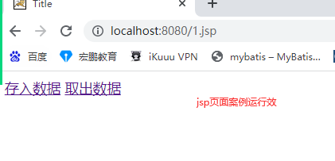
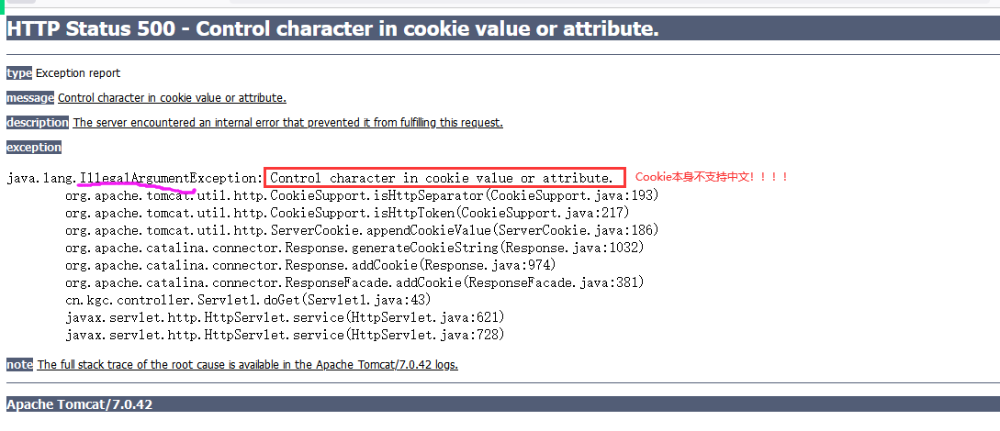
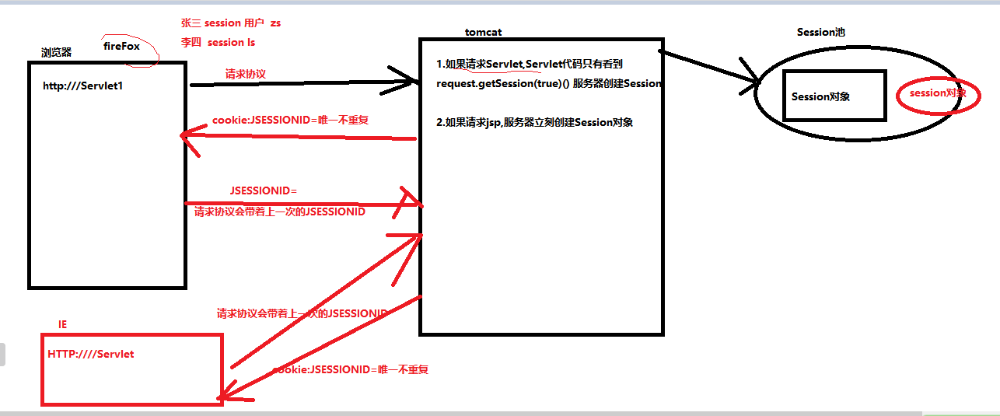
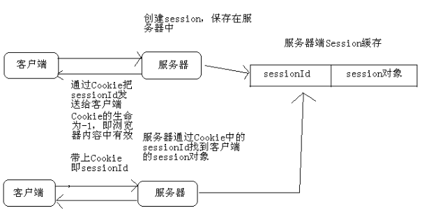

# 课程回顾

CRUD基本要求：完成两表的连接查询、单表的添加、修改和删除

```html
1 多条件模糊查询
 1-1 dao层SQL拼接方式
  sql语句尾部if+append()完成sql条件
  query(sql,,list.toArray())

 1-2 多条件回显问题：
  查询按钮，查询结果，还要将查询条件再一次转发jsp显示
  <select>
      
  </select>
2 分页
```

# 课程目标

## 1 分页

## 2 会话技术

## 3 Cookie

## 4 Session

# 课程实施

## 1 分页

### 1-1 Page类

理解page类作用，Page类SSM提供了

```html
作用：Page类封装整个分页查询的结果，将结果转发给jsp显示
```

```java
package cn.kgc.domain;

import java.util.List;

/**
 * @Author: lc
 * @Date: 2022/5/21
 * @Description: 保存jsp需要显示分页信息
 * @Version: 1.0
 */
public class Page<T> { //new Page<BookInfo>
	/**
	 * 分页后需要显示的查询结果集合信息
	 * 即jsp表格需要显式图书信息
	 */
	private List<T> list;
	//总页数  字段  数据库列名称为字段
	//private Integer totalPages;
	//查询结果总行数
	private Integer totalResults;
	//页大小
	private Integer pageSize;
	//页码,当前显示的页码
	private Integer pageNum;
	//是否有下一页
	//private boolean hasNextPage;
	//是否有上一页
	//private boolean hasPrevPage;

	//属性：getter 只读属性
	public List<T> getList() {
		return list;
	}
	//属性：setter 只写属性
	public void setList(List<T> list) {
		this.list = list;
	}
	// el读取数据${totalPages}
	public Integer getTotalPages() {
		//举例 13/3==>总页码：4+1  15/3==>总页码5页
		return getTotalResults()%getPageSize()!=0?getTotalResults()/getPageSize()+1:getTotalResults()/getPageSize();
	}

	/*public void setTotalPages(Integer totalPages) {
		this.totalPages = totalPages;
	}*/

	public Integer getTotalResults() {
		return totalResults;
	}

	public void setTotalResults(Integer totalResults) {
		this.totalResults = totalResults;
	}

	public Integer getPageSize() {
		return pageSize;
	}

	public void setPageSize(Integer pageSize) {
		this.pageSize = pageSize;
	}

	public Integer getPageNum() {
		return pageNum;
	}

	public void setPageNum(Integer pageNum) {
		this.pageNum = pageNum;
	}

	public boolean isHasNextPage() {
		return getPageNum()!=getTotalPages();
	}

	//public void setHasNextPage(boolean hasNextPage) {
	//	this.hasNextPage = hasNextPage;
	//}

	public boolean isHasPrevPage() {
		return getPageNum()!=1;
	}

	//public void setHasPrevPage(boolean hasPrevPage) {
	//	this.hasPrevPage = hasPrevPage;
	//}
}
```

### 1-2 Servlet针对查询结果实现分页

#### dao层BookInfoDaoImpl完成分页sql的实现

```java
@Override
	public List<BookInfo> selectAll(Integer bookType, String bookName, Integer isBorrow,
									Integer pageNum,Integer pageSize) {
		//执行SQL语句
		StringBuilder sb=new StringBuilder();
		sb.append(" SELECT book_info.book_id id,book_info.book_code, ");
		sb.append(" book_info.book_name,book_info.book_type, ");
		sb.append(" book_info.book_author,book_info.publish_press, ");
		sb.append(" book_info.publish_date,book_info.is_borrow, ");
		sb.append(" book_type.type_name FROM book_info ");
		sb.append(" LEFT JOIN book_type ON book_info.book_type=book_type.id ");
		//where 1=1作用：条件的拼接关键字and设置进去
		sb.append(" where 1=1 ");
		//String判断两个值：null ""
		//将所有的？对应的实参，使用集合保存
		List params=new ArrayList();
		if(!Objects.isNull(bookType)){
			sb.append(" AND book_info.book_type=? ");
			params.add(bookType);
		}
		if(!Objects.isNull(bookName)&&!bookName.isEmpty()){
			sb.append(" AND book_info.book_name LIKE ? ");
			params.add("%"+bookName+"%");
		}
		if(!Objects.isNull(isBorrow)){
			sb.append(" AND book_info.is_borrow=? ");
			params.add(isBorrow);
		}
		//添加分页语句
		sb.append(" LIMIT ?,? ");
		//limit语句第一个？对应的实参
		params.add((pageNum-1)*pageSize);
		//limit语句第二个？对应的实参
		params.add(pageSize);
		//qr.query(String 要执行的sql语句，
		// BeanHandler BeanListHandler ScalarHandler 转换的类型，
		// Object... sql语句？对应的实参）
		try {
			return qr.query(sb.toString(),
					new BeanListHandler<>(BookInfo.class),
					// Object... 底层就是数组，所以集合必须转换为数组，底层才能正常解析
					params.toArray());
		} catch (SQLException e) {
			throw new RuntimeException(e);
		}
	}
```

#### dao层BookInfoDaoImpl处理count()获取查询结果总行数

```java
@Override
	public Object selectCount(Integer bookType, String bookName, Integer isBorrow) {
		//执行SQL语句
		StringBuilder sb=new StringBuilder();
		sb.append(" SELECT count(*) fROM book_info ");
		sb.append(" LEFT JOIN book_type ON book_info.book_type=book_type.id ");
		//where 1=1作用：条件的拼接关键字and设置进去
		sb.append(" where 1=1 ");
		//String判断两个值：null ""
		//将所有的？对应的实参，使用集合保存
		List params=new ArrayList();
		if(!Objects.isNull(bookType)){
			sb.append(" AND book_info.book_type=? ");
			params.add(bookType);
		}
		if(!Objects.isNull(bookName)&&!bookName.isEmpty()){
			sb.append(" AND book_info.book_name LIKE ? ");
			params.add("%"+bookName+"%");
		}
		if(!Objects.isNull(isBorrow)){
			sb.append(" AND book_info.is_borrow=? ");
			params.add(isBorrow);
		}

		//qr.query(String 要执行的sql语句，
		// BeanHandler BeanListHandler ScalarHandler 转换的类型，
		// Object... sql语句？对应的实参）
		try {
			return qr.query(sb.toString(),
					new ScalarHandler<>(),
					// Object... 底层就是数组，所以集合必须转换为数组，底层才能正常解析
					params.toArray());
		} catch (SQLException e) {
			throw new RuntimeException(e);
		}
	}
```

#### servlet层BookInfoServlet完成将service返回的查询结果，封装成Page类对象

```java
package cn.kgc.controller; /**
 * @Author: lc
 * @Date: 2022/5/17
 * @Description: ${PACKAGE_NAME}
 * @Version: 1.0
 */

import cn.kgc.domain.BookInfo;
import cn.kgc.domain.BookType;
import cn.kgc.domain.Page;
import cn.kgc.service.BookInfoService;
import cn.kgc.service.impl.BookInfoServiceImpl;
import cn.kgc.service.impl.BookTypeServiceImpl;

import javax.servlet.ServletException;
import javax.servlet.annotation.WebServlet;
import javax.servlet.http.HttpServlet;
import javax.servlet.http.HttpServletRequest;
import javax.servlet.http.HttpServletResponse;
import java.io.IOException;
import java.util.List;

@WebServlet("/BookInfoServlet")
public class BookInfoServlet extends HttpServlet {
	@Override
	protected void doGet(HttpServletRequest request, HttpServletResponse response) throws ServletException, IOException {
		//请求发送的搜索条件中，图书名称可能是中文，GET必须处理中文
		//tomcat8 9 10针对get没有乱码
        //取 请求体或url地址传输的表单数据？略
		String bookTypeStr = request.getParameter("bookType");//请求没有数据时，bookTypeStr null
		String bookName = request.getParameter("bookName");//bookName null
		String pageNumStr=request.getParameter("pageNum");
		Integer pageSize=3;
		//解决get请求乱码问题 trim():去除字符串首尾的无效空格
		if (bookName!=null && !bookName.trim().isEmpty()) {
			bookName=new String(bookName.getBytes("iso8859-1"),"utf-8");
		}
		String isBorrowStr = request.getParameter("isBorrow");

		//类型转换
		Integer pageNum=1;
		try {
			//valueOf(null)不能正常转换
			pageNum=Integer.valueOf(pageNumStr);
		} catch (Exception e) {	}
		Integer bookType=null;
		try {
			//valueOf(null)不能正常转换
			bookType=Integer.valueOf(bookTypeStr);
		} catch (Exception e) {	}

		Integer isBorrow=null;
		try {
			//valueOf(null)不能正常转换
			isBorrow=Integer.valueOf(isBorrowStr);
		} catch (Exception e) {	}
		//调 service层
        BookInfoService service = new BookInfoServiceImpl();
        //思考：查询按钮提交请求，是不是可以使用这个Servlet来处理？？
        List<BookInfo> books = service.getAll(bookType,bookName,isBorrow,pageNum,pageSize);
        //查询结果封装成Page对象
		Page<BookInfo> page=new Page<>();
		//设置属性，以便jsp显示
		page.setList(books);
		page.setPageNum(pageNum);//1
		page.setPageSize(pageSize);//3
		//books是分页查询结果集合，books.size作为总行数使用吗？不行
		//查询结果的总行数：dao+ select count(*) from 。。。。
		Integer count = new BookInfoServiceImpl().getCount(bookType, bookName, isBorrow);
		page.setTotalResults(count);//3

        //查询图书分类信息
		List<BookType> types = new BookTypeServiceImpl().getAllBookTypes();
		//存 共享
        //request.setAttribute("list",books);//显示图书信息
		request.setAttribute("page",page);
        request.setAttribute("types",types);//显示图书分类信息
		//为了实现查询条件的回显，所以要将所有查询条件存入域
		//查询条件封装成一个类对象，一次性存入转发给jsp
		request.setAttribute("type",bookType);
		request.setAttribute("bookName",bookName);
		request.setAttribute("borrow",isBorrow);
        //转
        //jsp本质就是一个servlet
        request.getRequestDispatcher("/booklist.jsp").forward(request,response);
	}

	@Override
	protected void doPost(HttpServletRequest request, HttpServletResponse response) throws ServletException, IOException {
		doGet(request, response);
	}
}
```

#### booklist.jsp实现分页

```jsp
<%@ page contentType="text/html;charset=UTF-8" language="java" %>
<%--导入jstl依赖
prefix设置值 自定义，一般建议以导入库单词首字母
uri: 使用标签官方提供的一个访问路径
--%>
<%@ taglib prefix="c" uri="http://java.sun.com/jsp/jstl/core" %>
<html>
<head>
    <title>Title</title>
</head>
<script type="text/javascript">
    /**
     * 实现分页+多条件查询
     * @param pn表示查询条件下查询页码
     */
    function doSearch(pn){
        //单击查询按钮，向BookInfoServlet发出请求
        //发出请求时，需要带着查询条件过去
        //form走POST   地址栏地址能变，就是发请求统一get
        // window.open();
        //js支持EL
        //定义字符串，保存搜索条件
        var query="bookType="+document.getElementById("type").value;//?应该是用户实际输入的数据
        query+="&bookName="+document.getElementById("book_name").value;
        query+="&isBorrow="+document.getElementById("borrow").value;
        //分页需要的参数pageNum
        if(!pn){//go按钮，进行分页，页码是读取的文本框用户输入的值
            pn=document.getElementById('txtPageNo').value
        }
        //对于用户输入的非法值，做一下合法性校验
        if(pn<1 || pn>${page.totalPages}){
            pn=1;
        }
        query+="&pageNum="+pn;
        location.href="${pageContext.servletContext.contextPath}/BookInfoServlet?"+query;
        // location.assign();
    }
</script>
<body>
<table border="1px" cellspacing="0px" align="center">
    <tr>
        <td align="center">
            <h2 align="center">图书借阅系统</h2>
            <!--<p align="center">-->
            图书分类：
            <select name="book_type" id="type">
                <option value="">全部</option>
                <%--    从数据库查询的图书分类 --%>
                <c:forEach items="${types}" var="t">
                    <%--  要求：value指定主键  innerText:列值 汉字 --%>
                    <option value="${t.id}"
                            <c:if test="${type==t.id}">
                            selected
                         </c:if>
                    >${t.type_name}</option>
                </c:forEach>
            </select>
            图书名称：<input type="text" id="book_name" value="${bookName}"/>
            是否借阅：
            <select name="is_borrow" id="borrow">
                <option value="">===请选择====</option>
                <option value="1"
                    <c:if test="${borrow==1}">
                        selected
                    </c:if>
                >已借阅
                </option>
                <option value="0"
                        <c:if test="${borrow==0}">
                            selected
                        </c:if>
                >未借阅
                </option>
            </select>
            <%--
            submit和Image 提交表单按钮
            reset 重置按钮
            button 普通按钮
            --%>
            <input type="button" value="查询" id="search" onclick="doSearch(1)"/>
            <!--</p>-->
            <p align="right">
                <%--
                    <a href="${pageContext.servletContext.contextPath}/servlet或jsp"></a>
                --%>
                <a href="${pageContext.servletContext.contextPath}/GetBookTypesServlet">新增图书</a>
            </p>
            <%--
            写地址如何区分是否带web项目名称
            看浏览器地址是否会发生变化
            带web路径
            转发不用带项目名
            --%>

            <%-- dreamwearver --%>
            <table width="100%" border="1" cellspacing="0" cellpadding="0">
                <caption>
                    图书信息一览表
                </caption>
                <tr>
                    <th>编号</th>
                    <th>图书编号</th>
                    <th>图书名称</th>
                    <th>图书分类</th>
                    <th>图书作者</th>
                    <th>出版社</th>
                    <th>出版日期</th>
                    <th>借阅状态</th>
                    <th>查看详情</th>
                    <th>操作</th>
                </tr>
                <%
                    //java
                    //for
                %>
                <c:forEach items="${page.list}" var="book">
                    <tr>
                            <%-- el 使用属性名必须与类中定义属性名大小写一样 --%>
                        <td>${book.id}</td>
                        <td>${book.book_code}</td>
                        <td>${book.book_name}</td>
                        <td>${book.book_author}</td>
                        <td>${book.type_name}</td>
                        <td>${book.publish_press}</td>
                        <td>${book.publish_date}</td>
                        <td>${book.is_borrow?"已借阅":"未借阅"}</td>
                        <td><a href="">查看详情</a></td>
                        <td>
                                <%--
                                  浏览器的地址会发生变化：地址里面就必须出现/项目
                                  浏览器地址不变化：地址就一定不要/项目
                                  ${pageContext.servletContext.contextPath}
                                  自动获取发布时配置的项目访问名称

                                  jsp或html中，数据提交的方式：GET协议走url地址  POST协议，走的请求体
                                  GET请求提交参数格式：
                                  url?name=value&name2=value2&....&namen=valuen

                                --%>
                            <a href="${pageContext.servletContext.contextPath}/RemoveServlet?id=${book.id}"
                               onclick="return confirm('确认删除么？');">删除</a>
                            &nbsp;&nbsp;&nbsp;&nbsp;
                            <a href="${pageContext.servletContext.contextPath}/GetModifyBookInfoServlet?id=${book.id}">修改</a>
                        </td>
                    </tr>
                </c:forEach>
                <tr>
                    <td colspan="6" align="center">
                        <a href="javascript:doSearch(1);">首页</a>
                        <%-- 控制jsp翻页问题 --%>
                        <c:choose>
                            <c:when test="${!page.hasPrevPage}">
                                上一页
                            </c:when>
                            <c:otherwise>
                                <%--  超链接外观：鼠标停留变成小手形状 href不能删除，超链接的外观就不好看--%>
                                <a href="javascript:doSearch(${page.pageNum-1})">上一页</a>
                            </c:otherwise>
                        </c:choose>
                        <c:choose>
                            <c:when test="${!page.hasNextPage}">
                                下一页
                            </c:when>
                            <c:otherwise>
                                <a href="javascript:doSearch(${page.pageNum+1})">下一页</a>
                            </c:otherwise>
                        </c:choose>
                        <a href="javascript:doSearch(${page.totalPages})">尾页</a>
                        ${page.pageNum}/${page.totalPages}页
                        <input type="text" id="txtPageNo" size="2" value="${page.pageNum}" />
                        <input type="button" value="Go" name="go" onclick="doSearch()"/>
                    </td>
                </tr>
            </table>
        </td>
    </tr>
</table>
</body>
</html>
```

## 2 会话跟踪技术

### 2-1 会话概念

```html
会话即：浏览器和服务器之间的一次会晤。
浏览器打开，会话产生，浏览器关闭，会话结束

会话跟踪技术：用于浏览器从打开到关闭期间多个请求需要共享的数据解决方案
```

### 2-2 如何实现会话跟踪

```html
客户端技术：Cookie
服务器端技术：Session

Cookie:数据存在客户端（即浏览器），优点缓解服务器存储数据的压力
Session:数据存在服务器上，缺点：数据量存储较大，消费服务器资源更多，服务器收到资源使用压力
```

### 2-3 Cookie技术实现

```html
服务器通过IE将cookie数据存入客户端，服务器也只能通过ie获取存储的数据
意味着：
IE存数据
火狐取数据
```

### 2-4 Cookie实现

特点：浏览器关闭，cookie保存的数据就丢失了。

保证cookie的数据不丢失的话，默认情况下，浏览器不能关闭

```html
存入数据步骤：

1. servlet中创建Cookie对象
Cookie c=new Cookie(key,value);
2.将cookie发送给浏览器保存
response.addCookie(保存cookie对象)


setMaxAge()设置Cookie有效期，Cookie数据存在时间与浏览器的开始和关闭没有关系，只要时间到了，Cookie的数据就被清理了。
注意事项：
1.setMaxAge(-1):默认配置，浏览器关闭，数据丢失
2.setMaxAge(0):设置cookie作废
3.cookie的获取有浏览器之分

取出数据：
Cookie的数据统一由请求协议请求头提交服务器
1. reqeust.getCookies();
2. 循环那key与要找的数据key进行比较，获取key对应值即可
```

### 2-5 课堂案例



```html
1.ServletA 存入数据：随机数
2.ServletB 获取数据：显示获取的随机数
```

#### ServletA存入数据

```java
package cn.kgc.controller; /**
 * @Author: lc
 * @Date: 2022/5/23
 * @Description: ${PACKAGE_NAME}
 * @Version: 1.0
 */

import javax.servlet.*;
import javax.servlet.http.*;
import javax.servlet.annotation.*;
import java.io.IOException;
import java.util.UUID;

@WebServlet("/ServletA")
public class ServletA extends HttpServlet {
	@Override
	protected void doGet(HttpServletRequest request, HttpServletResponse response) throws ServletException, IOException {
        //1.使用Cookie保存一个随机数
        //1-1 创建Cookie对象
        //随机数实现：Math.random():[0,1)  new Random().nextInt(max):[0,Max)
        //UUID：java提供一个生成全球唯一标识符工具类
        UUID uuid = UUID.randomUUID();
        Cookie myCookie=new Cookie("num",uuid.toString());
        //干预cookie的存活时间
		myCookie.setMaxAge(2*60);//单位：秒
        //1-2 cookie发送给浏览器保存
        response.addCookie(myCookie);

        //写响应体
        response.setContentType("text/html;charset=utf-8");
        response.getWriter().print("cookie保存成功！");
	}

	@Override
	protected void doPost(HttpServletRequest request, HttpServletResponse response) throws ServletException, IOException {
		doGet(request, response);
	}
}
```

#### ServletB获取数据

```java
package cn.kgc.controller; /**
 * @Author: lc
 * @Date: 2022/5/23
 * @Description: ${PACKAGE_NAME}
 * @Version: 1.0
 */

import javax.servlet.*;
import javax.servlet.http.*;
import javax.servlet.annotation.*;
import java.io.IOException;

@WebServlet("/ServletB")
public class ServletB extends HttpServlet {
	@Override
	protected void doGet(HttpServletRequest request, HttpServletResponse response) throws ServletException, IOException {
        //1.获取这个浏览器提交的所有的cookie
        //细节：浏览器上没有保存任何跟该服务器相关的cookie，getCookie()返回值：null
        Cookie[] cookies = request.getCookies();
        //2.循环
        if(cookies==null || cookies.length==0){
            //响应：没有cookie数据
        }else{
            for(Cookie c:cookies){
                //getName():获取cookie的key  getValue():获取key对应的value
                if(c.getName().equals("num")){
                    //获取该key对应的值
                    String value = c.getValue();
                    response.getWriter().print("uuid:"+value);
                }
            }
        }
    }

	@Override
	protected void doPost(HttpServletRequest request, HttpServletResponse response) throws ServletException, IOException {
		doGet(request, response);
	}
}
```

### 2-6 学生练习

```html
案例：显示上次访问时间
1.ServletA存入当前时间
2.ServletB获取当前时间

扩展：
ServletC获取时间是上一次访问时间？
```

#### 参考代码

```java
package cn.kgc.controller; /**
 * @Author: lc
 * @Date: 2022/5/23
 * @Description: 显示“上一次访问时间”
 * @Version: 1.0
 */

import javax.servlet.ServletException;
import javax.servlet.annotation.WebServlet;
import javax.servlet.http.Cookie;
import javax.servlet.http.HttpServlet;
import javax.servlet.http.HttpServletRequest;
import javax.servlet.http.HttpServletResponse;
import java.io.IOException;
import java.net.URLDecoder;
import java.net.URLEncoder;
import java.text.SimpleDateFormat;
import java.util.Date;

@WebServlet("/Servlet1")
public class Servlet1 extends HttpServlet {
	@Override
	protected void doGet(HttpServletRequest request, HttpServletResponse response) throws ServletException, IOException {
	    response.setContentType("text/html;charset=utf-8");
        //1.尝试获取上一次访问时间
        Cookie[] cookies = request.getCookies();
        if(cookies==null || cookies.length==0) {
            //2.如果上次访问时间的key不存在，提示：首次访问该网站
            response.getWriter().print("首次访问该网站");
        }else {
            //3.如果上次访问时间的key存在，提示：上一次访问该网站时间是：
            for(Cookie c:cookies){
                if(c.getName().equals("lastTime")){
                    String value = c.getValue();
					//解码
					value= URLDecoder.decode(value,"utf-8");
                    //May 23 Mon 2022
                    response.getWriter().print("上一次访问该网站时间是："+value);
                }
            }
        }
        //cookie保存本次访问的时间，以便于下一次访问时获取
        Date now = new Date();
        //SimpleDateFormat
        SimpleDateFormat sdf = new SimpleDateFormat("yyyy年MM月dd日 HH时mm分ss秒SSS");
        String dateStr = sdf.format(now);
		//解决cookie存储中文的问题
		dateStr= URLEncoder.encode(dateStr,"utf-8");
        Cookie myCookie=new Cookie("lastTime",dateStr);
        myCookie.setMaxAge(2*60);
        response.addCookie(myCookie);
	}

	@Override
	protected void doPost(HttpServletRequest request, HttpServletResponse response) throws ServletException, IOException {
		doGet(request, response);
	}
}
```

### Cookie保存中文的问题以及解决方案



```java
		//中文存入Cookie前使用URL编码
		String name = URLEncoder.encode("姓名", "UTF-8");
	    String value = URLEncoder.encode("张三", "UTF-8");
        //编码后的字符串保存到Cookie中
		Cookie c = new Cookie(name, value);
		c.setMaxAge(3600);
		response.addCookie(c);

		//从Cookie中获取中文后解码后再打印。
        String name = URLDecoder.decode(c.getName(), "UTF-8");
        String value = URLDecoder.decode(c.getValue(), "UTF-8");
        String s = name + ": " + value + "<br/>";
        response.getWriter().print(s);
```

## 3 Session

特点：所有的数据存在服务器上

四大域对象：Session request

```java
setAttribute(key,value)
getAttribute(key)
removeAttribute(key)
```

### 3-2 如何创建Session

```java
1 request.getSession()和request.getSession(true):默认传入true，有Session直接返回session对象，如果没有session，创建session
    
2 request.getSession(boolean bool):false，有session获取session，如果服务器没有session，返回NULL
    
```

### 3-3 服务器保存Session的原理



#### 课堂案例

```java
package cn.kgc.controller; /**
 * @Author: lc
 * @Date: 2022/5/23
 * @Description: ${PACKAGE_NAME}
 * @Version: 1.0
 */

import javax.servlet.*;
import javax.servlet.http.*;
import javax.servlet.annotation.*;
import java.io.IOException;

@WebServlet("/Servlet11")
public class Servlet11 extends HttpServlet {
	@Override
	protected void doGet(HttpServletRequest request, HttpServletResponse response) throws ServletException, IOException {
        //服务器帮我生成一个Session对象（我是指实际访问Servlet11那个浏览器）
        HttpSession session = request.getSession();
        //getId():获取Session对象分配给每个浏览器的唯一标识
        response.getWriter().print("给您生成的sessionid是："+session.getId());
    }

	@Override
	protected void doPost(HttpServletRequest request, HttpServletResponse response) throws ServletException, IOException {
		doGet(request, response);
	}
}

```

#### 使用不同的浏览器访问Servlet11

每个浏览器上显示的id都不一样。




# 作业

CRUD+分页

# 预习

Session

JSP内置对象

文件下载和 上传