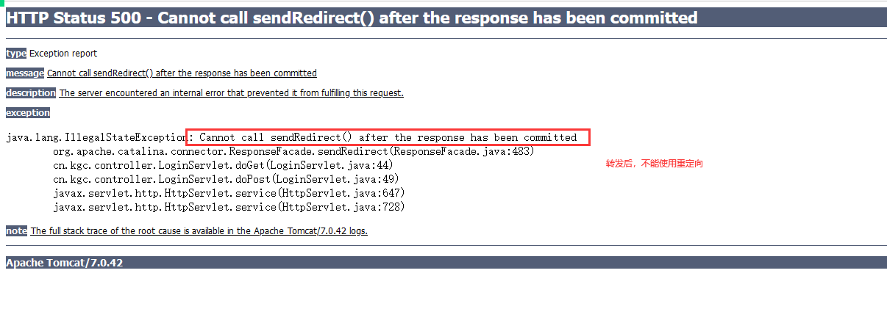

# 课程回顾

## 1 Cookie的使用步骤

```html
1-1 存入数据
//存入中文，中文进行编码
value=URLEncoder.encode(value,"码表");
Cookie myCookie=new Cookie(name,value);
//设置cookie的有效期
myCookie.setMaxAge(n);//秒
//发送给浏览器
response.addCookie(myCookie);

1-2 获取Cookie
Cookie[] cookies=request.getCookies();
for(Cookie c:cookies){
	if(c.getName.equals("要找的cookie的名称")){
			value=c.getValue;
			//取出中文，对中文进行解码
			value=URLDecoder.decode(value,"码表");
	}
}
```

## 2 Cookie的有效期

```html
默认情况：Cookie存储的数据，随着浏览器关闭，数据丢失
一般，如果想延长cookie的有效期，可以setMaxAge()设置有效期。Cookie丢失与否与浏览器关闭没有关系
```

## 3 会话跟踪技术

```html
会话：服务器与浏览器之间一次会晤
随着浏览器打开，会话就产生，浏览器关闭，会话就结束
一个会话：包含多次的请求和响应
```

# 课程目标

## 1 Session对象

## 2 验证码实现

## 3 JSP实现原理

## 4 文件下载

# 课程实施

## 1 Session

### 1-1 概念

```html
特点：存储服务器端
```

### 1-2 原理

```html
思考：Session的有效期的问题？
Session的数据确实随着浏览器关闭，数据就读取不到！！session的数据在服务器依然存在，默认保存30分钟，为什么浏览器重启之后，session数据获取不到？
原因：
保存JSSIONID的cookie的生命周期默认的：cookie随着浏览器关闭，数据都会丢失

如果希望session在浏览器重启后还能拿到session保存的数据，解决方案：
延长保存JSESSIONID的cookie的生命周期
```

#### 修改session有效期的方式

- web.xml

```xml
<?xml version="1.0" encoding="UTF-8"?>
<web-app xmlns="http://java.sun.com/xml/ns/javaee"
           xmlns:xsi="http://www.w3.org/2001/XMLSchema-instance"
           xsi:schemaLocation="http://java.sun.com/xml/ns/javaee
		  http://java.sun.com/xml/ns/javaee/web-app_2_5.xsd"
           version="2.5">
<!--
服务器上，一个session的有效期是设置的，设置的顺序是什么，如果自己的项目没有配置session的有效期，
服务器就读取服务器的web.xml里面的配置
-->
    <session-config>
        <session-timeout>30</session-timeout>
    </session-config>
</web-app>
```

### 1-3 课堂案例

```html
需求：
1.登录页面 jsp
2.实现登录功能 Servlet
  登录成功，将登录的用户信息保存Session
  重定向到index.jsp
  index.jsp上面显示当前登录用户名
```

#### 参考代码

- login.jsp

```jsp
<%@ page language="java" import="java.util.*" pageEncoding="UTF-8"%>

<!DOCTYPE HTML PUBLIC "-//W3C//DTD HTML 4.01 Transitional//EN">
<html>
<head>
    <title>login.jsp</title>
</head>
<script type="text/javascript">
    function change(obj){
        //obj:当前显示验证码的img标签
        //?num=new Date().getTime()作用：实现服务器识别到这是一个新的请求，所以生成一个新的验证码
        obj.src="${pageContext.servletContext.contextPath}/vc?num="+new Date().getTime();
    }
</script>
<body>
<h1>login.jsp</h1>
<hr/>
${msg}
<form action="${pageContext.servletContext.contextPath}/LoginServlet" method="post">
    用户名：<input type="text" name="username" /><br/>
    <input type="submit" value="登录"/>
</form>
</body>
</html>
```

- LoginServlet.java

```java
package cn.kgc.controller; /**
 * @Author: lc
 * @Date: 2022/5/24
 * @Description: ${PACKAGE_NAME}
 * @Version: 1.0
 */

import javax.servlet.*;
import javax.servlet.http.*;
import javax.servlet.annotation.*;
import java.io.IOException;

@WebServlet("/LoginServlet")
public class LoginServlet extends HttpServlet {
	@Override
	protected void doGet(HttpServletRequest request, HttpServletResponse response) throws ServletException, IOException {
		request.setCharacterEncoding("utf-8");
		//1.取
		String username = request.getParameter("username");
		//2.存 Session对象
		//2-1 获取Session对象,getSession(true)和getSession() 尝试获取，如果获取不到，创建一个Session对象
		//getSession(false):只取，不会创建
		//Servlet获取session，建议getSession()或getSession(true)
		HttpSession session = request.getSession();
		//2-2 存数据
		session.setAttribute("user",username);
		//2-3 延长Cookie的生命周期
		//同名的情况下，新的cookie覆盖以前cookie
		Cookie c=new Cookie("JSESSIONID",session.getId());
		//设置cookie的有效期
		c.setMaxAge(30*60);
		response.addCookie(c);

		//3.重定向：会产生两个请求
		response.sendRedirect(getServletContext().getContextPath()+"/index.jsp");
	}

	@Override
	protected void doPost(HttpServletRequest request, HttpServletResponse response) throws ServletException, IOException {
		doGet(request, response);
	}
}

```

- index.jsp

```jsp
<%@ page contentType="text/html;charset=UTF-8" language="java" %>
<html>
<head>
    <title>Title</title>
</head>
<body>
用户名：${user} <a href="${pageContext.servletContext.contextPath}/LogoutServlet">安全退出</a>
<h1>欢迎进入xxx管理系统</h1>
</body>
</html>
```

- LogoutServlet.java

```java
package cn.kgc.controller; /**
 * @Author: lc
 * @Date: 2022/5/24
 * @Description: ${PACKAGE_NAME}
 * @Version: 1.0
 */

import javax.servlet.*;
import javax.servlet.http.*;
import javax.servlet.annotation.*;
import java.io.IOException;

@WebServlet("/LogoutServlet")
public class LogoutServlet extends HttpServlet {
	@Override
	protected void doGet(HttpServletRequest request, HttpServletResponse response) throws ServletException, IOException {
		//1.获取session对象 session如果不存在，返回值NULL
		HttpSession session = request.getSession(false);
		//2.调用方法，使session失效
		if(session!=null){
			//session失效的方案
			session.invalidate();
			//session存入用户信息，手动删除
			//session.removeAttribute("user");
		}
	}

	@Override
	protected void doPost(HttpServletRequest request, HttpServletResponse response) throws ServletException, IOException {
		doGet(request, response);
	}
}
```

## 2 验证码使用步骤

```html
1.项目中引入ValidateCode.java文件
2.jsp使用
3.loginServlet处理用户输入的验证码和正确的验证码一样的
如果不一样，就不要再做登录验证
```

### 2-1 验证码作用

```html
防范暴力破解、暴力登录...
在我们注册时，如果没有验证码的话，可以使用while(true)来注册！那么服务器就废了！
验证码可以去识别发出请求的是人还是程序！当然，如果聪明的程序可以去分析验证码图片！但分析图片也不是一件容易的事，因为一般验证码图片都会带有干扰线，人都看不清，那么程序一定分析不出来。
```

### 2-2 验证码的使用案例

- login.jsp

```jsp
<%@ page language="java" import="java.util.*" pageEncoding="UTF-8"%>

<!DOCTYPE HTML PUBLIC "-//W3C//DTD HTML 4.01 Transitional//EN">
<html>
<head>
    <title>login.jsp</title>
</head>
<script type="text/javascript">
    function change(obj){
        //obj:当前显示验证码的img标签
        //?num=new Date().getTime()作用：实现服务器识别到这是一个新的请求，所以生成一个新的验证码
        obj.src="${pageContext.servletContext.contextPath}/vc?num="+new Date().getTime();
    }
</script>
<body>
<h1>login.jsp</h1>
<hr/>
${msg}
<form action="${pageContext.servletContext.contextPath}/LoginServlet" method="post">
    用户名：<input type="text" name="username" /><br/>
    验证码：<input type="text" name="vc"/>
    <br/>
    <input type="submit" value="登录"/>
</form>
</body>
</html>
```

- LoginServlet.jsp

```java
package cn.kgc.controller; /**
 * @Author: lc
 * @Date: 2022/5/24
 * @Description: ${PACKAGE_NAME}
 * @Version: 1.0
 */

import javax.servlet.*;
import javax.servlet.http.*;
import javax.servlet.annotation.*;
import java.io.IOException;

@WebServlet("/LoginServlet")
public class LoginServlet extends HttpServlet {
	@Override
	protected void doGet(HttpServletRequest request, HttpServletResponse response) throws ServletException, IOException {
		request.setCharacterEncoding("utf-8");
		//1.取
		String username = request.getParameter("username");
		String vc = request.getParameter("vc");
		//获取正确的验证码
		String rightVC = request.getSession(false).getAttribute("vc").toString();
		if(!vc.equalsIgnoreCase(rightVC)){
			request.setAttribute("msg","验证码输入有误！");
			//重新发回login.jsp
			//带着错误的消息
			request.getRequestDispatcher("/login.jsp").forward(request,response);
			return;
		}
		//2.存 Session对象 
		HttpSession session = request.getSession();
		//2-2 存数据
		session.setAttribute("user",username);
		//2-3 延长Cookie的生命周期
		//同名的情况下，新的cookie覆盖以前cookie
		Cookie c=new Cookie("JSESSIONID",session.getId());
		//设置cookie的有效期
		c.setMaxAge(30*60);
		response.addCookie(c);

		//3.重定向：会产生两个请求
		response.sendRedirect(getServletContext().getContextPath()+"/index.jsp");
	}

	@Override
	protected void doPost(HttpServletRequest request, HttpServletResponse response) throws ServletException, IOException {
		doGet(request, response);
	}
}

```

## 坑点



## 3 URL实现方式

### 3-1 url使用场景

```html
当浏览器禁用cookie时，为了保证session数据可以正常获取，就必须在各个资源之间带着JSESSIONID来实现session数据的获取。
```

### 3-2 URL重写的实现方式

#### jsp页面的实现url重写

```jsp
<%
String webName=request.getServletContext().getContextPath();
%>

<form action='<%=response.encodeURL(webName+"/LoginServlet")%>' method="post">
    用户名：<input type="text" name="username" /><br/>
    验证码：<input type="text" name="vc"/>
    <br/>
    <input type="submit" value="登录"/>
</form>
```

#### servlet实现url重写

```java
package cn.kgc.controller; 
import javax.servlet.*;
import javax.servlet.http.*;
import javax.servlet.annotation.*;
import java.io.IOException;

@WebServlet("/LoginServlet")
public class LoginServlet extends HttpServlet {
	@Override
	protected void doGet(HttpServletRequest request, HttpServletResponse response) throws ServletException, IOException {
		request.setCharacterEncoding("utf-8");
		//1.取
		String username = request.getParameter("username");
		
		//2.存 Session对象
		//2-1 获取Session对象,getSession(true)和getSession() 尝试获取，如果获取不到，创建一个Session对象
		//getSession(false):只取，不会创建
		//Servlet获取session，建议getSession()或getSession(true)
		HttpSession session = request.getSession();
		//2-2 存数据
		session.setAttribute("user",username);
		//2-3 延长Cookie的生命周期
		//同名的情况下，新的cookie覆盖以前cookie
		Cookie c=new Cookie("JSESSIONID",session.getId());
		//设置cookie的有效期
		c.setMaxAge(30*60);
		response.addCookie(c);

		//3.重定向：会产生两个请求
		//cookie禁用之后，希望能够正常获取Session的数据，原理：程序员需要手动在各个资源之间传递JSESSIONID
		//response.sendRedirect(getServletContext().getContextPath()+"/index.jsp?JSESSIONID="+session.getId());
		//url重写
		String url = response.encodeRedirectURL("/index.jsp");
		response.sendRedirect(url);
	}

	@Override
	protected void doPost(HttpServletRequest request, HttpServletResponse response) throws ServletException, IOException {
		doGet(request, response);
	}
}

```

## 4 文件下载

### 4-1 实现步骤

```html
1.提供下载资源：
 下载图片、exe文件
下载资源存放位置：WEB-INF下面
WEB-INF下面原因：WEB-INF下面的资源在浏览器上面不能直接访问。都是安全的

**************设置一个响应头：content-disposition**************

2.服务器文件实现复制到客户端
U1使用IO流：图片复制
```

### 4-2 参考代码

#### download.jsp

```jsp
<%@ page contentType="text/html;charset=UTF-8" language="java" %>
<html>
<head>
    <title>下载页面</title>
</head>
<body>
<a href="${pageContext.servletContext.contextPath}/DownLoadServlet?fileName=aa.jpg">宠物猫</a>
<a href="${pageContext.servletContext.contextPath}/DownLoadServlet?fileName=花.jpg">向日葵</a>
</body>
</html>
```

#### DownLoadServet.java

```java
package cn.kgc.controller; /**
 * @Author: lc
 * @Date: 2022/5/24
 * @Description: ${PACKAGE_NAME}
 * @Version: 1.0
 */

import javax.servlet.ServletException;
import javax.servlet.ServletOutputStream;
import javax.servlet.annotation.WebServlet;
import javax.servlet.http.HttpServlet;
import javax.servlet.http.HttpServletRequest;
import javax.servlet.http.HttpServletResponse;
import java.io.IOException;
import java.io.InputStream;
import java.net.URLEncoder;

@WebServlet("/DownLoadServlet")
public class DownLoadServlet extends HttpServlet {
	@Override
	protected void doGet(HttpServletRequest request, HttpServletResponse response) throws ServletException, IOException {
		//取：下载的图片的名称
		String fileName = request.getParameter("fileName");
		//文件名称：中文乱码问题
		fileName=new String(fileName.getBytes("iso8859-1"),"utf-8");
		//实现复制：服务器的图片使用IO写出到浏览器
		//InputStream is=new FileInputStream("/WEB-INF/download/"+fileName);
		//getServletContext():获取tomcat服务器上实际发布的web项目对象
		InputStream is=getServletContext().getResourceAsStream("/WEB-INF/download/"+fileName);
		byte[] bs=new byte[1024];
		int len;
		String agent=request.getHeader("User-Agent");

		//解决文件另存时设置中文名称问题，火狐不识别
		if(agent.toLowerCase().contains("firefox")){
			//解决火狐的识别问题 IE识别
			fileName=new String(fileName.getBytes("utf-8"),"iso8859-1");
		}else{//IE  Chrome
			fileName= URLEncoder.encode(fileName,"utf-8");
		}
		//下载关键弹出另存为的窗口：设置响应头 content-disposition头名称，"attachment;filename=" + 另存默认保存文件名称
		response.setHeader("content-disposition", "attachment;filename=" + fileName);
		ServletOutputStream os = response.getOutputStream();
		while((len=is.read(bs))!=0){
			//一边读取图片的字节，一边输出到新的文件中
			os.write(bs,0,len);
			os.flush();
		}
		//先开后关
		os.close();
		is.close();
	}

	@Override
	protected void doPost(HttpServletRequest request, HttpServletResponse response) throws ServletException, IOException {
		doGet(request, response);
	}
}

```


# 总结

1 session实现数据的存取

2 session作为服务器端存储数据的形式，当浏览器禁用cookie之后，可以使用URL重写的技术解决Session取值问题！！

3.文件下载

# 预习安排

文件上传和下载

AJAX处理