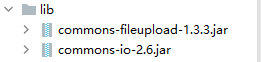
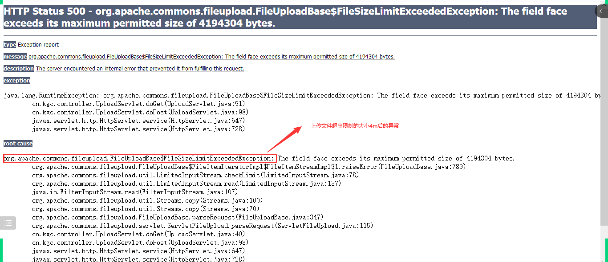
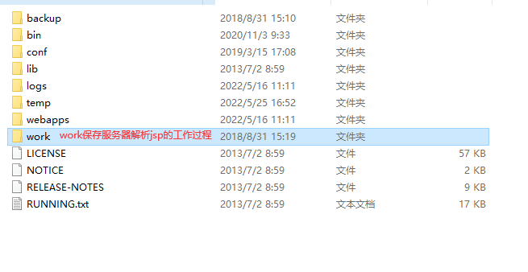
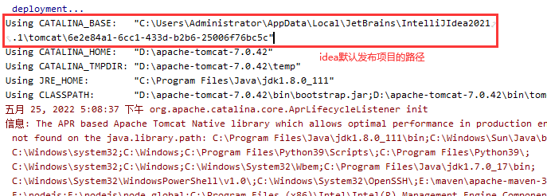
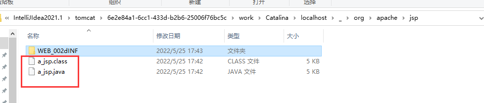
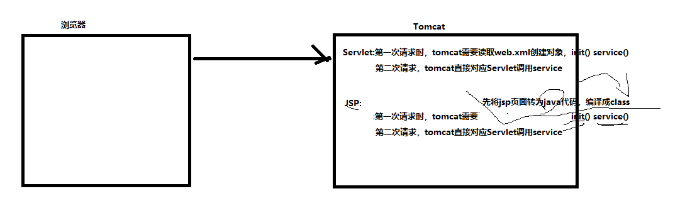
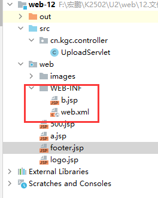
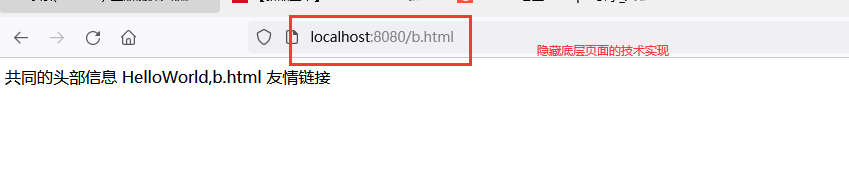
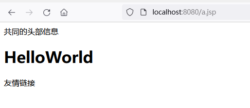

# 课程回顾

## 1 session基本使用

```html
1 servlet中，通过getSession()获取对象
2 setAttribute()完成数据存储
3 getAttribute()获取数据
```

## 2 session底层实现

```html
session生命周期：
1.session数据保存服务器上，服务器保存session的默认时常：30分钟
2.session底层基于cookie在浏览器端存储一个JSESSIONID，cookie默认生命周期浏览器关闭，cookie就会丢失，session在浏览器重启之后，数据也获取不到
3.延迟session的JSESSIONID存储时常，通过修改Cookie的setMaxAge()  
```

## 3 验证码

12306买票系统使用验证码

```html
3-1 生成验证码

3-2 看不清，换一张
3-3 服务器端 session对象获取正确的验证码
```

## 4 URL重写 ======== 了解

```html
解决问题：浏览器禁用cookie
URL重写技术实现原理：保证每次跟服务器交互过程中，url地址带上JSESSIONID
格式：
url;JSESSIOINID=session.getId()
JAVAX提供实现url重写的方法：
response.encodeURL()
response.encodeRedirectURL()
```

## 5 文件下载 ******

```html
步骤：
1.提供文件下载的资源，资源通常保存位置：WEB-INF下面
2.jsp页面如何提供下载链接
<a href=".....?下载的文件名称"></a>
3.Servlet如何实现下载
response.setHeader("content-disposition","attachment;fileName=定义文件名称");
IO流输出
```

# 课程目标

## 1 文件上传 ======== 理解

## 2 四大域对象 ====== 理解

## 3 JSP使用 ======== 理解

# 课程实施

## 1 文件上传

### 1-1 文件上传和下载

日常项目常用的功能

提问：淘宝、京东文件上传的功能？

举例：头像、评价+加图、商家上架图片上传

OA系统：秘书起草文件，上传给领导审核

### 1-2 文件上传步骤

```html
1.必须使用表单，而不能是超链接；<input type=file>
a)超链接走get请求，get提交数据在浏览器地址栏上面
2.表单的method必须是POST，而不能是GET；
a)GET：get传递数据时候，用查询字符串，在地址栏明码传递，地址栏传递的数据长度有限制，文件过大地址栏数据丢失问题。
3.表单的enctype必须是multipart/form-data；
a)Enctype:application/x-www-mulipat…
i.客户端向服务器发送表单数据name=value
b)multipart/form-data
c)常见普通form提交post，请求体 username:值
4.在表单中添加file表单字段，即<input type=”file”…/>
```

#### 1 jsp页面的设计

```jsp
<%@ page contentType="text/html;charset=UTF-8" language="java" %>
<html>
<head>
  <title>文件上传</title>
</head>
<body>
<%--
application/x-www-form-urlencoded:表单默认数据提交格式
--%>
<form action="${pageContext.servletContext.contextPath}/UploadServlet" method="post"
      enctype="multipart/form-data">
  用户名：<input type="text" name="username"/><br/>
  头像图片：<input type="file" name="face"/><br/>
  <input type="submit" value="注册"/>
</form>
</body>
</html>
```

#### 2 添加文件上传的依赖



#### 3 UploadServlet实现文件上传

```java
package cn.kgc.controller; 
import org.apache.commons.fileupload.FileItem;
import org.apache.commons.fileupload.disk.DiskFileItemFactory;
import org.apache.commons.fileupload.servlet.ServletFileUpload;

import javax.servlet.ServletException;
import javax.servlet.annotation.WebServlet;
import javax.servlet.http.HttpServlet;
import javax.servlet.http.HttpServletRequest;
import javax.servlet.http.HttpServletResponse;
import java.io.File;
import java.io.IOException;
import java.util.List;

@WebServlet("/UploadServlet")
public class UploadServlet extends HttpServlet {
	@Override
	protected void doGet(HttpServletRequest request, HttpServletResponse response) throws ServletException, IOException {
		//取
		//request.getParameter()不再适用
		//ServletOutputStream out = response.getOutputStream();//输出响应体
		//ServletInputStream in = request.getInputStream();//请求体
		//读取上传文件的内容？？肯定可以读
		//依赖fileupload.jar
		//1.创建工厂对象
		DiskFileItemFactory factory=new DiskFileItemFactory();
		//2.创建Servlet端使用请求解析器
		ServletFileUpload upload=new ServletFileUpload(factory);
		//3.通过解析器将request转换为List<FileItem>
		//3-1 FileItem:form表提交的一个一个表单项的数据
		try {
			List<FileItem> fileItems = upload.parseRequest(request);
			for(FileItem item :fileItems) {
				//获取用户提交的用户名  普通表单项  type=text password
				if(item.isFormField()){//true:普通的表单项
					//item.getFieldName():<input type="" name=""/>获取表单项的name属性值
					//getString():当前这个表单项提交的数据
					System.out.println(item.getFieldName()+"提交的数据是："+item.getString());
				}else {
					//获取用户提交图片 文件域 type=file
					//实现文件上传
					/*
					* 实现原理：将浏览器提交的文件，使用io复制到服务器端
					 */
					//InputStream in = item.getInputStream();
					//文件复制后放在服务器的什么地方呢？
					//获取服务器指定文件路径，常用代码
					//getName():获取文件域上次文件实际的名称
					String savePath=getServletContext().getRealPath("/WEB-INF/upload/"+item.getName());//获取指定目录在服务器上的绝对路径
					File os=new File(savePath);
					//实现实际文件保存
					item.write(os);
				}
			}
		} catch (Exception e) {
			e.printStackTrace();
		}

	}

	@Override
	protected void doPost(HttpServletRequest request, HttpServletResponse response) throws ServletException, IOException {
		doGet(request, response);
	}
}

```

### 1-3 文件上传的实现细节

#### 中文乱码问题

```java
//解决上传文件中文乱码的问题
response.setCharacterEncoding("utf-8");
//如果以上代码不能处理中文乱码，可以在getString()时再处理
fileItem.getString("utf-8")
```

#### 文件格式问题

```java
/*上传图片文件：
    文件合法格式：jpg jpeg png gif bmp ico
  */
String fileFullName = item.getName();//提交上传文件的全名
//获取文件后缀名
String lastName = fileFullName.substring(fileFullName.lastIndexOf("."));
//限制文件格式：jpg jpeg png....
String[] rightLastName={"jpg","jpeg","gif","bmp"};
//文件是否合法
boolean isOk=false;//默认不合法
for(String name:rightLastName){
    if(fileFullName.toLowerCase().endsWith(name)){
        isOk=true;
    }
}
if(!isOk){
    //不合法
    request.setAttribute("msg","只能上传后缀名是："+ Arrays.toString(rightLastName));
    request.getRequestDispatcher("/upload.jsp").forward(request,response);
    return;
}
```

#### 上传文件大小问题

```java
/*
单个图片限制大小：4m以内 4m=4*1024*1024==>字节
 file.length()://单位字节*/
//1.创建工厂对象
DiskFileItemFactory factory=new DiskFileItemFactory();

//2.创建Servlet端使用请求解析器
ServletFileUpload upload=new ServletFileUpload(factory);

//设置单个文件上传的大小
upload.setFileSizeMax(4*1024*1024);//如果单个文件超过4m，抛出500的异常

//3.通过解析器将request转换为List<FileItem>
List<FileItem> fileItems = upload.parseRequest(request);
```



#### 文件重名的问题

```java
//文件名称以上传的时间命名：now().getTime().jpg 
String fileFullName = item.getName();//提交上传文件的全名
//获取文件后缀名
String lastName = fileFullName.substring(fileFullName.lastIndexOf("."));
//自动生成一个服务器端保存的文件名称
String fileFirstName=new Date().getTime()+"";//123432435.jpg
//生成新的保存文件的名称
String newFileFullName=fileFirstName+lastName;
//获取指定目录在服务器上的绝对路径
String savePath=getServletContext().getRealPath("/WEB-INF/upload/"+newFileFullName);

System.out.println(savePath);
File os=new File(savePath);

//实现实际文件保存
item.write(os);
```

### 1-4 文件上传解决细节问题的完整代码

```java
package cn.kgc.controller;

import org.apache.commons.fileupload.FileItem;
import org.apache.commons.fileupload.disk.DiskFileItemFactory;
import org.apache.commons.fileupload.servlet.ServletFileUpload;

import javax.servlet.ServletException;
import javax.servlet.annotation.WebServlet;
import javax.servlet.http.HttpServlet;
import javax.servlet.http.HttpServletRequest;
import javax.servlet.http.HttpServletResponse;
import java.io.File;
import java.io.IOException;
import java.util.Arrays;
import java.util.Date;
import java.util.List;

@WebServlet("/UploadServlet")
public class UploadServlet extends HttpServlet {
	@Override
	protected void doGet(HttpServletRequest request, HttpServletResponse response) throws ServletException, IOException {
		//解决上传文件中文乱码的问题
		response.setCharacterEncoding("utf-8");
		//取
		//request.getParameter()不再适用
		//ServletOutputStream out = response.getOutputStream();//输出响应体
		//ServletInputStream in = request.getInputStream();//请求体
		//读取上传文件的内容？？肯定可以读
		//依赖fileupload.jar
		//1.创建工厂对象
		DiskFileItemFactory factory=new DiskFileItemFactory();

		//2.创建Servlet端使用请求解析器
		ServletFileUpload upload=new ServletFileUpload(factory);
		//设置单个文件上传的大小
		upload.setFileSizeMax(4*1024*1024);//如果单个文件超过4m，抛出500的异常
		//3.通过解析器将request转换为List<FileItem>
		//3-1 FileItem:form表提交的一个一个表单项的数据
		try {
			List<FileItem> fileItems = upload.parseRequest(request);
			for(FileItem item :fileItems) {
				//获取用户提交的用户名  普通表单项  type=text password
				if(item.isFormField()){//true:普通的表单项
					//item.getFieldName():<input type="" name=""/>获取表单项的name属性值
					//getString(编码格式):解决中文乱码当前这个表单项提交的数据
					System.out.println(item.getFieldName()+"提交的数据是："+item.getString("utf-8"));
				}else {
					//获取用户提交图片 文件域 type=file
					//实现文件上传
					/*
					* 实现原理：将浏览器提交的文件，使用io复制到服务器端
					 */
					//InputStream in = item.getInputStream();
					//文件复制后放在服务器的什么地方呢？
					//获取服务器指定文件路径，常用代码
					//getName():获取文件域上次文件实际的名称
					//getRealPath("必须以/开始，且不包含web层")
					String fileFullName = item.getName();//提交上传文件的全名
					//获取文件后缀名
					String lastName = fileFullName.substring(fileFullName.lastIndexOf("."));
					//限制文件格式：jpg jpeg png....
					String[] rightLastName={"jpg","jpeg","gif","bmp"};
					//文件是否合法
					boolean isOk=false;//默认不合法
					for(String name:rightLastName){
						if(fileFullName.toLowerCase().endsWith(name)){
							isOk=true;
						}
					}
					if(!isOk){
						//不合法
						request.setAttribute("msg","只能上传后缀名是："+ Arrays.toString(rightLastName));
						request.getRequestDispatcher("/upload.jsp").forward(request,response);
						return;
					}
					//自动生成一个服务器端保存的文件名称
					String fileFirstName=new Date().getTime()+"";//123432435.jpg
					String newFileFullName=fileFirstName+lastName;
					String savePath=getServletContext().getRealPath("/WEB-INF/upload/"+newFileFullName);//获取指定目录在服务器上的绝对路径

					System.out.println(savePath);
					File os=new File(savePath);
					//实现实际文件保存
					item.write(os);
				}
			}
		} catch (Exception e) {
			throw new RuntimeException(e);
		}

	}

	@Override
	protected void doPost(HttpServletRequest request, HttpServletResponse response) throws ServletException, IOException {
		doGet(request, response);
	}
}
```

## 2 JSP周边

tomcat服务器上保存jsp解析的目录是work目录，但是因为idea发布项目的方式是虚拟路径的形式，所以在idea中发布的项目并没有实际放在tomcat的webapps下面：



idea发布项目的实际路径是在tomcat日志信息中“Using CATALINA_BASE"对应的路径上：



拿到项目的发布路径后，进入发布目录，找打work，可以看到JSP在服务器上的解析过程





使用记事本或其他阅读工具，打开a_jsp.java文件，通过阅读代码会有以下发现

**注意：HttpJspBase 的父类是 HttpServlet** 

```java
package org.apache.jsp;

import javax.servlet.*;
import javax.servlet.http.*;
import javax.servlet.jsp.*;

public final class a_jsp extends org.apache.jasper.runtime.HttpJspBase
    implements org.apache.jasper.runtime.JspSourceDependent {

  private static final javax.servlet.jsp.JspFactory _jspxFactory =
          javax.servlet.jsp.JspFactory.getDefaultFactory();

  private static java.util.Map<java.lang.String,java.lang.Long> _jspx_dependants;

  static {
    _jspx_dependants = new java.util.HashMap<java.lang.String,java.lang.Long>(2);
  }

  private javax.el.ExpressionFactory _el_expressionfactory;
  private org.apache.tomcat.InstanceManager _jsp_instancemanager;

  public java.util.Map<java.lang.String,java.lang.Long> getDependants() {
    return _jspx_dependants;
  }

  public void _jspInit() {
    _el_expressionfactory = _jspxFactory.getJspApplicationContext(getServletConfig().getServletContext()).getExpressionFactory();
    _jsp_instancemanager = org.apache.jasper.runtime.InstanceManagerFactory.getInstanceManager(getServletConfig());
  }

  public void _jspDestroy() {
  }

  public void _jspService(final javax.servlet.http.HttpServletRequest request, final javax.servlet.http.HttpServletResponse response)
        throws java.io.IOException, javax.servlet.ServletException {

    final javax.servlet.jsp.PageContext pageContext;
    javax.servlet.http.HttpSession session = null;
    final javax.servlet.ServletContext application;
    final javax.servlet.ServletConfig config;
    javax.servlet.jsp.JspWriter out = null;
    final java.lang.Object page = this;
    javax.servlet.jsp.JspWriter _jspx_out = null;
    javax.servlet.jsp.PageContext _jspx_page_context = null;


    try {
      response.setContentType("text/html;charset=UTF-8");
      pageContext = _jspxFactory.getPageContext(this, request, response,
      			"500.jsp", true, 8192, true);
      _jspx_page_context = pageContext;
      application = pageContext.getServletContext();
      config = pageContext.getServletConfig();
      session = pageContext.getSession();
      out = pageContext.getOut();
      _jspx_out = out;

      out.write("\r\n");
      out.write("\r\n");
      out.write('\r');
      out.write('\n');
      out.write("\r\n");
      out.write("\r\n");
      out.write("<html>\r\n");
      out.write("<head>\r\n");
      out.write("    <title>Title</title>\r\n");
      out.write("</head>\r\n");
      out.write("<body>\r\n");
      out.write("<h1>HelloWorld</h1>\r\n");

    //jsp鐨剆ervice()鍐呯疆session瀵硅薄锛屾湇鍔″櫒甯綘鍒涘缓濂戒簡锛屾墍浠ョ▼搴忓憳鍙互鐩存帴浣跨敤

    //session.setAttribute("","");

    //System.out.println(12/0);

      out.write("\r\n");
      out.write("</body>\r\n");
      out.write("</html>\r\n");
      out.write('\r');
      out.write('\n');
    } catch (java.lang.Throwable t) {
      if (!(t instanceof javax.servlet.jsp.SkipPageException)){
        out = _jspx_out;
        if (out != null && out.getBufferSize() != 0)
          try { out.clearBuffer(); } catch (java.io.IOException e) {}
        if (_jspx_page_context != null) _jspx_page_context.handlePageException(t);
        else throw new ServletException(t);
      }
    } finally {
      _jspxFactory.releasePageContext(_jspx_page_context);
    }
  }
}
```

### 2-1 jspのpage指令

#### 设置errorPage

```jsp
<%@ page contentType="text/html;charset=UTF-8" language="java" isErrorPage="true" %>
<html>
<head>
    <title>错误页</title>
</head>
<body>

</body>
</html>

```

#### 设置jsp出错时，进入错误页

```jsp
<%--
errorPage="指定出错显示页面"
--%>
<%@ page contentType="text/html;charset=UTF-8" language="java" errorPage="500.jsp" %>

<html>
<head>
    <title>Title</title>
</head>
<body>
<h1>HelloWorld</h1>
<%
    //jsp的service()内置session对象，服务器帮你创建好了，所以程序员可以直接使用

    //session.setAttribute("","");

    System.out.println(12/0);
%>
</body>
</html>
```

### 2-2 JSPの配置

#### 将jsp页面放在WEB-INF下面



#### 在web.xml配置b.jsp的访问路径

```xml
<?xml version="1.0" encoding="UTF-8"?>
<web-app xmlns="http://java.sun.com/xml/ns/javaee"
           xmlns:xsi="http://www.w3.org/2001/XMLSchema-instance"
           xsi:schemaLocation="http://java.sun.com/xml/ns/javaee
		  http://java.sun.com/xml/ns/javaee/web-app_2_5.xsd"
           version="2.5">
	<!--jsp配置-->
    <servlet>
        <servlet-name>bb</servlet-name>
        <jsp-file>/WEB-INF/b.jsp</jsp-file>
    </servlet>
    <servlet-mapping>
        <servlet-name>bb</servlet-name>
        <url-pattern>/b.html</url-pattern>
    </servlet-mapping>
</web-app>

```

#### 浏览器访问的方式：



### 2-3 jspのinclude指令

include:主要是实现多个页面的合并响应。

优点：解决jsp页面重复设计代码、重复的java代码问题

#### 实现方式如下：

#### header.jsp

```jsp
<%@ page contentType="text/html;charset=UTF-8" language="java" %>
<html>
<head>
    <title>Title</title>
</head>
<body>
共同的头部信息
</body>
</html>

```

#### footer.jsp

```jsp
<%@ page contentType="text/html;charset=UTF-8" language="java" %>
<html>
<head>
    <title>Title</title>
</head>
<body>
友情链接
</body>
</html>

```

#### 设计请求的页面：a.jsp

```jsp
<%--
errorPage="指定出错显示页面"
--%>
<%@ page contentType="text/html;charset=UTF-8" language="java" errorPage="500.jsp" %>
<%--多个jsp合并--%>
<%@include file="logo.jsp"%>
<html>
<head>
    <title>Title</title>
</head>
<body>
<h1>HelloWorld</h1>
<%
    System.out.println(12/2);
%>
</body>
</html>
<%@include file="footer.jsp"%>

```

#### 设计请求的页面：b.jsp

```jsp
<%@ page contentType="text/html;charset=UTF-8" language="java" %>
<%@include file="../logo.jsp"%>
<html>
<head>
    <title>Title</title>
</head>
<body>
HelloWorld,b.html
</body>
</html>
<%@include file="../footer.jsp"%>

```

#### 浏览器访问a.jsp效果



# 课程总结

```html
1 文件上传的基本流程
2 文件上传的细节实现：
  2-1 文件重名
  2-2 文件中文名乱码
  2-3 文件大小限制
  2-4 文件格式显示
3 JSP工作原理
3-1 work目录的跟踪
3-2 jsp在服务器端的解析过程
3-3 jsp常用指令page和include的基本使用案例
```

# 课程预习

ajax实现：

 原生态代码实现机制

JQuery提供ajax(,,,,)

前后端分离项目：基于ajax axious


