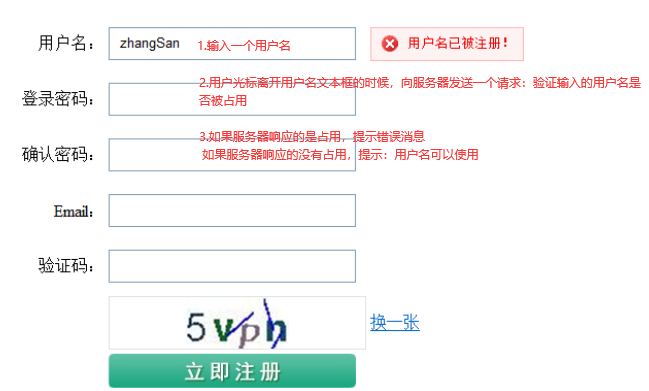
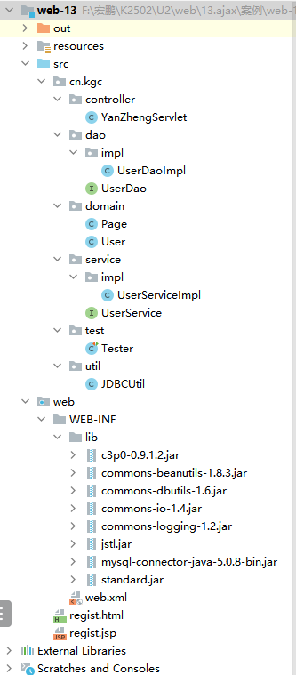
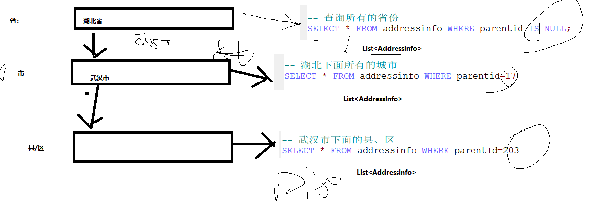
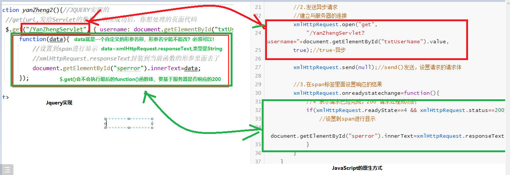

# 课程回顾

```html
1.文件上传
 1-1 文件上传的基本流程：jsp如何配置，如果提交Servlet，form属性配置 servlet实现上传：获取文件路径、验证文件格式、大小、重命名

2.jsp解析过程：work目录生成jsp对应java代码
2-1 配置isErrorPage errorPage错误页
2-2 jsp在web.xml进行配置
2-3 <%@include page=""%>
```

# 课程目标

## 1 ajax的作用 ======= 理解

## 2 ajax的XMLHttpRequest核心对象 ===== 理解

## 3.ajax实现============= 使用jquery完成

### 用户名唯一验证

### 三级联动

## 4 JSON数据的实现

# 课程实施

## 1 ajax

### 1-1 AJAX概念

ajax:异步的 JavaScript And XML技术。

XML格式不好解析，所以主流的ajax配合使用数据格式：JSON格式

### 1-2 Ajax意义

提升用户体验度

```html
1.同步请求
缺点：

2.异步请求：AJax
```





### 1-3 课堂案例的实现代码



#### domainのUser

```java
package cn.kgc.domain;

/**
 * @Author: lc
 * @Date: 2022/5/27
 * @Description: cn.kgc.domain
 * @Version: 1.0
 */
public class User {
	private String uid;
	private String username;
	private String password;

	public String getUid() {
		return uid;
	}

	public void setUid(String uid) {
		this.uid = uid;
	}

	public String getUsername() {
		return username;
	}

	public void setUsername(String username) {
		this.username = username;
	}

	public String getPassword() {
		return password;
	}

	public void setPassword(String password) {
		this.password = password;
	}

	@Override
	public String toString() {
		final StringBuilder sb = new StringBuilder("User{");
		sb.append("uid='").append(uid).append('\'');
		sb.append(", username='").append(username).append('\'');
		sb.append(", password='").append(password).append('\'');
		sb.append('}');
		return sb.toString();
	}
}
```

#### daoのUserDaoImpl

```java
package cn.kgc.dao.impl;

import cn.kgc.dao.UserDao;
import cn.kgc.domain.User;
import cn.kgc.util.JDBCUtil;
import org.apache.commons.dbutils.QueryRunner;
import org.apache.commons.dbutils.handlers.BeanHandler;

import java.sql.SQLException;

public class UserDaoImpl  implements UserDao {
	private QueryRunner qr=new QueryRunner(JDBCUtil.datasource);
	@Override
	public User selectBy(String username) {
		try {
			return qr.query("SELECT * FROM USER WHERE username=?",
					new BeanHandler<>(User.class),
					username);
		} catch (SQLException e) {
			throw new RuntimeException(e);
		}
	}
}
```

#### serviceのUserServiceImpl

```java
package cn.kgc.service.impl;

import cn.kgc.dao.UserDao;
import cn.kgc.dao.impl.UserDaoImpl;
import cn.kgc.domain.User;
import cn.kgc.service.UserService;

public class UserServiceImpl  implements UserService {
	//1.创建依赖的dao层对象
	UserDao dao=new UserDaoImpl();
	/**
	 * 验证用户名是否被占用
	 * @param username 用户要验证的用户名
	 * @return true-用户名未占用  false-用户名已占用
	 */
	@Override
	public boolean validateUserName(String username) {
		//2.调用dao层方法
		User user = dao.selectBy(username);
		return user==null;
	}
}
```

### 同步请求实现用户名的验证

#### jspのregist.jsp

```jsp
<%@ page contentType="text/html;charset=UTF-8" language="java" %>
<html>
<head>
    <title>用户注册页面</title>
</head>
<script type="text/javascript">
    /**
     * 同步请求：只要没有看到老师写ajax，都是同步请求
     */
    function yanZheng(){
        //js常用给服务器发请求：
        //思考思路：是否需要给/YanZhengServlet带参数，就看Servlet依赖的service的方法有没有参数
        //service的方法有参数，请求带参数
        location.href="${pageContext.servletContext.contextPath}/YanZhengServlet?username="+document.getElementById("txtUserName").value;
    }
</script>
<body>
<form>
    <p>
        用户名：<input id="txtUserName" type="text" name="user" onblur="yanZheng()"><span style="color: red;">${msg}</span>
    </p>
    <p>
        密码：<input type="text" name="pass">
    </p>
    <p>
        确认密码：<input type="text" name="repass">
    </p>
    <p>
        <input type="submit" value="注册">
        <input type="reset" value="清空">
    </p>
</form>
</body>
</html>
```

#### controllerのYanZhengServlet

```java
package cn.kgc.controller; /**
 * @Author: lc
 * @Date: 2022/5/27
 * @Description: ${PACKAGE_NAME}
 * @Version: 1.0
 */

import cn.kgc.service.UserService;
import cn.kgc.service.impl.UserServiceImpl;

import javax.servlet.*;
import javax.servlet.http.*;
import javax.servlet.annotation.*;
import java.io.IOException;

@WebServlet("/YanZhengServlet")
public class YanZhengServlet extends HttpServlet {
	@Override
	protected void doGet(HttpServletRequest request, HttpServletResponse response) throws ServletException, IOException {
		//1.取
		String username = request.getParameter("username");
		//2.调用
		UserService userService=new UserServiceImpl();
		boolean bool = userService.validateUserName(username);
		//3.存
		request.setAttribute("msg",bool?"用户名可用":"用户名已被占用，不可用");
		//4.转
		request.getRequestDispatcher("/regist.jsp").forward(request,response);
	}

	@Override
	protected void doPost(HttpServletRequest request, HttpServletResponse response) throws ServletException, IOException {
		doGet(request, response);
	}
}
```

### 异步请求实现用户名的验证

#### htmlのregist.html

```html
<!DOCTYPE html>
<html lang="zh">
<head>
    <meta charset="utf-8"/>
    <title>ajax实现用户名唯一性验证</title>
<!--    导入js的依赖类库文件-->
    <script type="text/javascript" src="/js/jquery-3.6.0.min.js"></script>
</head>

<script type="text/javascript">
    /**
     * 异步请求：XMLHttpRequest对象，代表使用AJAX
     */
    function yanZheng2(){//JQUERY实现的
        //get(url,发给Servlet的数据，响应成功后，你想处理的页面代码
        $.get("/YanZhengServlet", { username: document.getElementById("txtUserName").value },
            function(data){
                //设置到span进行显示
                //xmlHttpRequest.responseText封装到当前函数的形参里面去了
                document.getElementById("sperror").innerText=data;
            });
    }
</script>
<body>
<!--
JSP需求：EL+JSTL
html不支持EL+JSTL
-->
<form>
    <p>
        用户名：<input id="txtUserName" type="text" name="user" onblur="yanZheng2()">
        <span id="sperror" style="color: red;">？？？</span>
    </p>
    <p>
        密码：<input type="text" name="pass">
    </p>
    <p>
        确认密码：<input type="text" name="repass">
    </p>
    <p>
        <input type="submit" value="注册">
        <input type="reset" value="清空">
    </p>
</form>
</body>
</html>
```

#### controllerのYanZhengServlet

```java
package cn.kgc.controller; /**
 * @Author: lc
 * @Date: 2022/5/27
 * @Description: ${PACKAGE_NAME}
 * @Version: 1.0
 */

import cn.kgc.service.UserService;
import cn.kgc.service.impl.UserServiceImpl;

import javax.servlet.*;
import javax.servlet.http.*;
import javax.servlet.annotation.*;
import java.io.IOException;

@WebServlet("/YanZhengServlet")
public class YanZhengServlet extends HttpServlet {
	@Override
	protected void doGet(HttpServletRequest request, HttpServletResponse response) throws ServletException, IOException {
		//1.取
		String username = request.getParameter("username");
		//2.调用
		UserService userService=new UserServiceImpl();
		boolean bool = userService.validateUserName(username);
		//响应ajax请求，就要使用响应体响应
		response.setContentType("text/html;charset=utf-8");
		response.getWriter().print(bool?"用户名可用":"用户名已被占用，不可用");
	}

	@Override
	protected void doPost(HttpServletRequest request, HttpServletResponse response) throws ServletException, IOException {
		doGet(request, response);
	}
}

```

## 2 AJAX的核心对象

### 2-1 概念

AJAX的核心对象时XMLHttpRequest，在原生的JavaScript中，只有获取了XMLHttpRequest对象，才能完成异步请求的发送， 以及跟踪服务器端的响应和响应结果。

### 2-2 XMLHttpRequest使用方式

```javascript
原生态ajax实现步骤：
1.获取Ajax的核心对象：XmlHttpRequest
(1)new XmlHttpRequest()，只有火狐和google浏览器支持，IE各个版本使用对象不尽相同
必须解决IE浏览器核心对象获取
var xmlHttp;
 
 try
    {
   // Firefox, Opera 8.0+, Safari
    xmlHttp=new XMLHttpRequest();
    }
 catch (e)
    {

  // Internet Explorer
   try
      {
      xmlHttp=new ActiveXObject("Msxml2.XMLHTTP");
      }
   catch (e)
      {

      try
         {
         xmlHttp=new ActiveXObject("Microsoft.XMLHTTP");
         }
      catch (e)
         {
         alert("您的浏览器不支持AJAX！");
         return false;
         }
      }
    }


2.发送请求：get、post请求
xmlHttp.open(请求提交的方式GET/POST,Servlet的url地址,是否使用异步发送true-异步 false-同步);
xmlHttp.send(null);//send(请求体), post请求有请求体 send(“key=value”)，get没有请求体，send(null)

3.监听服务器的影响状态码：局部使用dom解析完成html、jsp页面的刷新
xmlHttp.onreadystatechange=function()
      {
//4表示请求已经处理完成，且 status==200指服务器成功处理
      if(xmlHttp.readyState==4&&xmlHttp.status==200)
        { 
          //dom解析代码，完成html、jsp最终的显示效果
         //xmlHttp.responseText:服务器响应体
         document.myForm.time.value=xmlHttp.responseText;
        }
      }
```

### 2-3 ajax实现的原生态代码

```javascript
function yanZheng(){
        //1.获取XmlHttpRequest对象
        var xmlHttpRequest;//定义变量名
        try{
            //Firefox Chrome
            xmlHttpRequest=new XMLHttpRequest();
        }catch(e){
            //IE7+
           try{
               xmlHttpRequest=new ActiveXObject("Msxml2.XMLHTTP")
           } catch (e) {
               //IE7-
               try{
                   xmlHttpRequest=new ActiveXObject("Microsoft.XMLHTTP")
               }catch (e) {
                   alert("您的浏览器不支持AJAX！");
                   return false;
               }
           }
        }
        //2.发送异步请求
        //建立与服务器的连接
        xmlHttpRequest.open("get",
            "/YanZhengServlet?username="+document.getElementById("txtUserName").value,
        true);//true-异步

        xmlHttpRequest.send(null);//send()发送，设置请求的请求体

        //3.在span标签里面设置响应的结果
        xmlHttpRequest.onreadystatechange=function(){
            //4 表示请求已经完成，200 请求处理成功的
            if(xmlHttpRequest.readyState==4 && xmlHttpRequest.status==200){
                //设置到span进行显示
                document.getElementById("sperror").innerText=xmlHttpRequest.responseText;
            }
        }
    }
```

## 3 JSON数据

### 3-1 概念

```html
JSON(JavaScript Object Notation) 是一种轻量级的数据交换格式。理解类似html文档格式、xml文档、doc文档、ppt、json、JavaScript
JSON是用字符串来表示Javascript对象，例如可以在Servlet中发送一个JSON格式的字符串给客户端Javascript，Javascript可以执行这个字符串，得到一个Javascript对象。
XML也可以用来数据交换，前面已经学习过在Servlet中发送XML给Javascript，然后Javascript再去解析XML。
```

### 3-2 json格式

```json
//单个json对象
var person = {"name":"zhangSan", "age":18, "sex":"male"};//java单个对象==》单个json对象
alert(person.name + ", " + person.age + ", " + person.sex);


//json对象数组  list==>json数组
Var people=[{"name":"zhangSan", "age":18, "sex":"male"},{"name":"zhangSan", "age":18, "sex":"male"},{"name":"zhangSan", "age":18, "sex":"male"}];
```

### 3-3 案例演示

```html
<!DOCTYPE html>
<html lang="zh">
<head>
    <meta charset="utf-8"/>
    <title>JSON解析方式</title>
</head>
<script type="text/javascript">
  //1.定义json对象
   var objJson={"name":"张三","age":24,"sayHello":function(){alert("Hello")}};
  //2.获取对象属性值，并调用方法
   document.write(objJson.name+",年龄 "+objJson.age);
   objJson.sayHello();
  var arrJson=[{"name":"张三","age":24,"sayHello":function(){alert("Hello")}},
    {"name":"李四","age":26,"sayHello":function(){alert("你好")}}];

  for(var i=0;i<arrJson.length;i++){
    objJs=arrJson[i];
    //2.获取对象属性值，并调用方法
    document.write(objJs.name+",年龄 "+objJs.age);
    objJs.sayHello();
  }
</script>
<body>

</body>
</html>
```

## 4 综合练习：三级联动



### 4-1 fastJson转换的结果

```json
[
	{
		"addName":"北京",
		"id":1
	},
	{
		"addName":"天津",
		"id":2
	},
	{
		"addName":"河北",
		"id":3
	},
	{
		"addName":"山西",
		"id":4
	},
	{
		"addName":"内蒙古",
		"id":5
	},
	{
		"addName":"辽宁",
		"id":6
	},
	{
		"addName":"吉林",
		"id":7
	},
	{
		"addName":"黑龙江",
		"id":8
	},
	{
		"addName":"上海",
		"id":9
	},
	{
		"addName":"江苏",
		"id":10
	},
	{
		"addName":"浙江",
		"id":11
	},
	{
		"addName":"安徽",
		"id":12
	},
	{
		"addName":"福建",
		"id":13
	},
	{
		"addName":"江西",
		"id":14
	},
	{
		"addName":"山东",
		"id":15
	},
	{
		"addName":"河南",
		"id":16
	},
	{
		"addName":"湖北",
		"id":17
	},
	{
		"addName":"湖南",
		"id":18
	},
	{
		"addName":"广东",
		"id":19
	},
	{
		"addName":"广西",
		"id":20
	},
	{
		"addName":"海南",
		"id":21
	},
	{
		"addName":"重庆",
		"id":22
	},
	{
		"addName":"四川",
		"id":23
	},
	{
		"addName":"贵州",
		"id":24
	},
	{
		"addName":"云南",
		"id":25
	},
	{
		"addName":"西藏",
		"id":26
	},
	{
		"addName":"陕西",
		"id":27
	},
	{
		"addName":"甘肃",
		"id":28
	},
	{
		"addName":"青海",
		"id":29
	},
	{
		"addName":"宁夏",
		"id":30
	},
	{
		"addName":"新疆",
		"id":31
	},
	{
		"addName":"香港",
		"id":32
	},
	{
		"addName":"澳门",
		"id":33
	},
	{
		"addName":"台湾",
		"id":34
	}
]
```

### 4-2 代码实现

#### jsp页面设计

```jsp
<%@ page contentType="text/html;charset=UTF-8" language="java" %>
<html>
<head>
    <title>三级联动</title>
  <!--    导入js的依赖类库文件-->
  <script type="text/javascript" src="/js/jquery-3.6.0.min.js"></script>
</head>
<script type="text/javascript">
  /*window.onload=function(){
    //省份加载上去
  }*/
  $(function(){//$(document).ready();
    //加载省份，可是省份数据从哪儿来呢？DB来，请求提交Servlet，$.getJson(url,data-不需要参数，就省略,function())
    $.getJSON("${pageContext.servletContext.contextPath}/GetProvinceServlet",function(arrJson){
      //json数组一个一个省份信息以option的方式在jsp显示
        //<option value="1">北京</option>
        $(arrJson).each(function(i,objJson){
            $("#prov").append($("<option value='"+objJson.id+"'>"+objJson.addName+"</option>"));
        });
    });//$.get() $.post()有什么区别？？？？形参一模一样，就是服务器给的数据格式JSON格式
    // $.get(,"json");//$.get()默认text，对应java数据类型是string
    // $.post(,"json")

      //基于省份修改的事件，加载所有的市
      $("#prov").change(function(){
          $.post("${pageContext.servletContext.contextPath}/GetProvinceServlet",
              {"parentId":this.value},function(arrJson){
                //清空：自己删除自己  父.empty():清空
                  $("#city option:gt(0)").remove();
                  //json数组一个一个省份信息以option的方式在jsp显示
                  $(arrJson).each(function(i,objJson){
                      $("#city").append($("<option value='"+objJson.id+"'>"+objJson.addName+"</option>"));
                  });
              },"json");
      });
  });
</script>
<body>
省：<select id="prov">
  <option>===请选择====</option>
</select>
<br>
市：<select id="city">
  <option>===请选择====</option>
</select>
<br>
县/区：<select id="region">
  <option>===请选择====</option>
</select>
<br>
</body>
</html>
```

#### Servletの获取省市区

```java
package cn.kgc.controller; /**
 * @Author: lc
 * @Date: 2022/5/27
 * @Description: ${PACKAGE_NAME}
 * @Version: 1.0
 */

import cn.kgc.domain.AddressInfo;
import cn.kgc.service.impl.AddressInfoServiceImpl;
import com.alibaba.fastjson.JSON;

import javax.servlet.ServletException;
import javax.servlet.annotation.WebServlet;
import javax.servlet.http.HttpServlet;
import javax.servlet.http.HttpServletRequest;
import javax.servlet.http.HttpServletResponse;
import java.io.IOException;
import java.util.ArrayList;
import java.util.List;

@WebServlet("/GetProvinceServlet")
public class GetProvinceServlet extends HttpServlet {
	@Override
	protected void doGet(HttpServletRequest request, HttpServletResponse response) throws ServletException, IOException {
        //取所有的省份
		String parentId = request.getParameter("parentId");
		List<AddressInfo> allProvince=new ArrayList<>();
		if(parentId==null) {
			allProvince = new AddressInfoServiceImpl().getAllProvince();
		}else{
			allProvince=new AddressInfoServiceImpl().getAllCities(Integer.parseInt(parentId));
		}
        //关键步骤：java中为了迎合ajax数据处理的需求，之间交换数据格式使用：json格式
        //一般简化json的格式转换，耗费无用工具，使用第三方的插件：阿里巴巴 fastjson
        String jsonStr = JSON.toJSONString(allProvince, true);//true:json格式阅读性更好
		System.out.println(jsonStr);
        //响应体回送ajax进行处理
        response.setContentType("text/html;charset=utf-8");
        response.getWriter().print(jsonStr);
    }

	@Override
	protected void doPost(HttpServletRequest request, HttpServletResponse response) throws ServletException, IOException {
		doGet(request, response);
	}
}
```

#### Serviceの获取省市区

```java
package cn.kgc.service.impl;

import cn.kgc.dao.AddressInfoDao;
import cn.kgc.dao.impl.AddressInfoDaoImpl;
import cn.kgc.domain.AddressInfo;
import cn.kgc.service.AddressInfoService;

import java.util.List;

public class AddressInfoServiceImpl implements AddressInfoService {
	private AddressInfoDao dao=new AddressInfoDaoImpl();
	@Override
	public List<AddressInfo> getAllProvince() {
		return dao.selectBy(null);
	}

	@Override
	public List<AddressInfo> getAllCities(Integer parentId) {
		return dao.selectBy(parentId);
	}
}
```

#### Daoの实现

```java
package cn.kgc.dao.impl;

import cn.kgc.dao.AddressInfoDao;
import cn.kgc.domain.AddressInfo;
import cn.kgc.util.JDBCUtil;
import org.apache.commons.dbutils.QueryRunner;
import org.apache.commons.dbutils.handlers.BeanListHandler;

import java.sql.SQLException;
import java.util.ArrayList;
import java.util.List;
import java.util.Objects;

public class AddressInfoDaoImpl implements AddressInfoDao {
	private QueryRunner qr=new QueryRunner(JDBCUtil.datasource);
	@Override
	public List<AddressInfo> selectBy(Integer parentId) {
		StringBuilder sb=new StringBuilder();
		sb.append("SELECT * FROM addressinfo WHERE 1=1");
		//定义保存？对应参数的集合
		List params=new ArrayList();
		if(Objects.isNull(parentId)){
			sb.append(" and parentid IS NULL;");
		}else{
			sb.append(" and parentid =?;");
			params.add(parentId);
		}
		try {
			return qr.query(sb.toString(),
					new BeanListHandler<>(AddressInfo.class),
					params.toArray()
			);
		} catch (SQLException e) {
			throw new RuntimeException(e);
		}
	}
}
```

### 4-3 get和原始ajax的类比



# 课程总结

用法：jquery的getJson()  get() post()

面试导向：原生态（核心对象是什么？XMLHttpRequest、open() send() onreadystatechange,responseText)

Ajax:完成课堂案例

过滤器和监听器

四大域对象


## 休息时间

周六休息

下周：周二休息


端午节：周五周六周日


