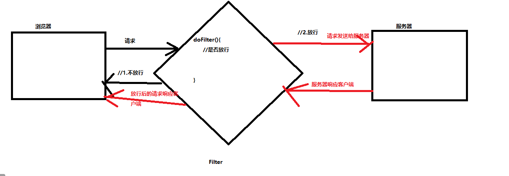
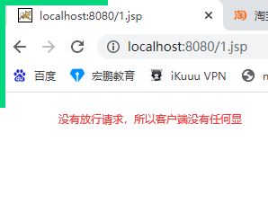

# 课程回顾

## 1 ajax意义

```html
ajax:实现页面局部刷新，提升用户使用体验度
ajax优点：
1. 页面性能更好
2. 用户体验度

ajax缺点：
1.ajax会造成客户端无意中发送更多请求，给服务器增加压力
```

## 2 ajax使用

### ajax原生态实现

```html
1.XMLHttpRequest对象
  var xhr=new XMLHttpRequest();
  ....
2.建立与服务器连接
 xhr.open(请求方式-get/post,"servlet的url",true); true：异步请求
3.发送请求
 xhr.send(post请求体"key=value");//get请求体，xhr.send(null)
4.监听器服务器响应状态
if(==4 && ==200){
  //响应体 xhr.responseText
  //DOM操作
}
```

### jquery封装ajax方法 ============ 掌握

```html
$.ajax();
$.get(url,{key:value,key:value},
function(data){

},响应体的格式：text html xml json javascript);
$.post(url,{key:value,key:value},
function(data){

});
$.getJson(url,{key:value,key:value},
function(data){

})
```

## json格式

```html
json={属性：属性值,....,属性：属性值}

arrJson=[{属性：属性值,....,属性：属性值},{属性：属性值,....,属性：属性值}]

json对象.属性名获取这个属性对应属性值
```

# 课程目标

## 1 过滤器 ===== 理解

## 2 监听器 ===== 理解

## 4 四大域区别和使用 ==== 理解

# 课程实施

## 1 过滤器

javaEE技术中，3大组件：Servlet、Filter-过滤器、Listener-监听器

Servlet作用：处理客户端发送请求，并响应

Filter-过滤器作用：过滤客户端请求，判断请求是否交给服务器进行处理。类似：安检功能

### 1-1 Filter使用

```html
1.创建一个类实现Filter接口
2.重写Filter接口所有的方法：
  2-1 init():初始化
  2-2 doFilter():过滤请求
  2-3 destroy():销毁
3.web.xml配置访问方式
```

### 1-2 Filter生命周期

```html
1.服务器启动，Filter就创建，而且Filter对象只会创建一次
2.浏览器发送监测请求，filter对象调用doFilter()
3.随着服务器的销毁，调用destroy()销毁所有的Filter对象
```

### 1-3 Filter执行过滤的过程



### 1-4 Filter的HelloWorld案例

#### 1.定义类实现Filter接口，并重写接口中所有的方法

```java
package cn.kgc.filter;

import javax.servlet.*;
import java.io.IOException;

public class MyFilter1 implements Filter {
	@Override
	public void init(FilterConfig filterConfig) throws ServletException {
		System.out.println("init....初始化过滤器....");
	}

	@Override
	public void doFilter(ServletRequest servletRequest, ServletResponse servletResponse, FilterChain filterChain) throws IOException, ServletException {
		System.out.println("doFilter....执行过滤请求....");
		//所有的请求到了MyFilter1过滤器，都没有放行
	}

	@Override
	public void destroy() {
		System.out.println("destroy....销毁过滤器");
	}
}
```

#### 2.配置Filter要过滤的请求

```xml
<?xml version="1.0" encoding="UTF-8"?>
<web-app xmlns="http://java.sun.com/xml/ns/javaee"
           xmlns:xsi="http://www.w3.org/2001/XMLSchema-instance"
           xsi:schemaLocation="http://java.sun.com/xml/ns/javaee
		  http://java.sun.com/xml/ns/javaee/web-app_2_5.xsd"
           version="2.5">
    <filter>
        <filter-name>myFilter1</filter-name>
        <filter-class>cn.kgc.filter.MyFilter1</filter-class>
    </filter>
    <filter-mapping>
        <filter-name>myFilter1</filter-name>
        <!--可不是写请求的路径，指定要过滤请求url地址
         所有的请求都要先走过滤器，/*
         指定特定请求要走过滤器 /index.jsp
        -->
        <url-pattern>/*</url-pattern>
    </filter-mapping>
</web-app>
```

#### 3.打开浏览器，请求过滤器拦截的请求，观察tomcat服务器日志信息



### 1-5 Filter的应用案例

#### 设置request和response的乱码

- EncodingFilter

```java
package cn.kgc.filter; 
import javax.servlet.*;
import java.io.IOException;

public class EncodingFilter implements Filter {
	public void init(FilterConfig config) throws ServletException {
	}

	public void destroy() {
	}

	@Override
	public void doFilter(ServletRequest request, ServletResponse response, FilterChain chain) throws ServletException, IOException {
	    //设置
        request.setCharacterEncoding("utf-8");
        response.setContentType("text/html;charset=utf-8");
		//放行
	    chain.doFilter(request, response);
	}
}
```

- web.xml

```xml
<?xml version="1.0" encoding="UTF-8"?>
<web-app xmlns="http://java.sun.com/xml/ns/javaee"
           xmlns:xsi="http://www.w3.org/2001/XMLSchema-instance"
           xsi:schemaLocation="http://java.sun.com/xml/ns/javaee
		  http://java.sun.com/xml/ns/javaee/web-app_2_5.xsd"
           version="2.5">
    <filter>
        <filter-name>EncodingFilter</filter-name>
        <filter-class>cn.kgc.filter.EncodingFilter</filter-class>
    </filter>
    <filter-mapping>
        <filter-name>EncodingFilter</filter-name>
        <!--可不是写请求的路径，指定要过滤请求url地址
         所有的请求都要先走过滤器，/*
         指定特定请求要走过滤器 /index.jsp
        -->
        <url-pattern>/*</url-pattern>
    </filter-mapping>
</web-app>
```

- login.jsp

```jsp
<%@ page contentType="text/html;charset=UTF-8" language="java" %>
<html>
<head>
    <title>用户登录页</title>
</head>
<body>
<form action="${pageContext.servletContext.contextPath}/LoginServlet" method="post">
    用户名：<input name="loginName"><br/>
    <input type="submit" value="登录">
</form>
</body>
</html>
```

- LoginServlet

```java
package cn.kgc.controller; 
import javax.servlet.*;
import javax.servlet.http.*;
import javax.servlet.annotation.*;
import java.io.IOException;

@WebServlet("/LoginServlet")
public class LoginServlet extends HttpServlet {
	@Override
	protected void doGet(HttpServletRequest request, HttpServletResponse response) throws ServletException, IOException {
	     //取 中文
		String loginName = request.getParameter("loginName");
		//调 假设用户名都是登录成功
		//用户名保存session中
		request.getSession().setAttribute("user",loginName);
		//将用户名响应到浏览器显示
		response.getWriter().print("您输入的用户名是"+loginName);
	}

	@Override
	protected void doPost(HttpServletRequest request, HttpServletResponse response) throws ServletException, IOException {
		doGet(request, response);
	}
}
```

#### 强制用户登录

```html
需求分析：
1. Session保存登录的用户名
2. 所有的请求进入过滤器，过滤器获取Session对象，判断Session有没有保存过用户名
2-1 已经存储的有用户名，说明用户登录了，放行
2-2 没有保存任何用户名，说明用户还没有登录，不能放行！！重定向到login.jsp
```

##### 参考代码

- ValidateLoginFilter

```java
package cn.kgc.filter; 
import javax.servlet.*;
import javax.servlet.http.HttpServletRequest;
import javax.servlet.http.HttpServletResponse;
import javax.servlet.http.HttpSession;
import java.io.IOException;

public class ValidateLoginFilter implements Filter {
	public void init(FilterConfig config) throws ServletException {
	}

	public void destroy() {
	}

	@Override
	public void doFilter(ServletRequest request, ServletResponse response, FilterChain chain) throws ServletException, IOException {
        HttpServletRequest req=(HttpServletRequest)request;
        //如果用户请求的login.jsp，不做任何验证，直接方案
        String uri = req.getRequestURI();
        if(uri.toLowerCase().contains("login.jsp")
                ||uri.toLowerCase().contains("loginservlet")){
            chain.doFilter(request, response);
            return;
        }
        HttpSession session = req.getSession(false);
        if (!(session==null||session.getAttribute("user")==null)) {
            chain.doFilter(request, response);
        } else {
            //强制去登录
            ((HttpServletResponse)response).sendRedirect("/login.jsp");
        }
    }
}
```

- web.xml

```xml
<?xml version="1.0" encoding="UTF-8"?>
<web-app xmlns="http://java.sun.com/xml/ns/javaee"
           xmlns:xsi="http://www.w3.org/2001/XMLSchema-instance"
           xsi:schemaLocation="http://java.sun.com/xml/ns/javaee
		  http://java.sun.com/xml/ns/javaee/web-app_2_5.xsd"
           version="2.5">
    <filter>
        <filter-name>ValidateLoginFilter</filter-name>
        <filter-class>cn.kgc.filter.ValidateLoginFilter</filter-class>
    </filter>
    <filter-mapping>
        <filter-name>ValidateLoginFilter</filter-name>
        <url-pattern>/*</url-pattern>
    </filter-mapping>
</web-app>

```

- login.jsp

```jsp
<%@ page contentType="text/html;charset=UTF-8" language="java" %>
<html>
<head>
    <title>用户登录页</title>
</head>
<body>
<form action="${pageContext.servletContext.contextPath}/LoginServlet" method="post">
    用户名：<input name="loginName"><br/>
    <input type="submit" value="登录">
</form>
</body>
</html>
```

- LoginServlet

```java
package cn.kgc.controller; 
import javax.servlet.*;
import javax.servlet.http.*;
import javax.servlet.annotation.*;
import java.io.IOException;

@WebServlet("/LoginServlet")
public class LoginServlet extends HttpServlet {
	@Override
	protected void doGet(HttpServletRequest request, HttpServletResponse response) throws ServletException, IOException {
	     //取 中文
		String loginName = request.getParameter("loginName");
		//调 假设用户名都是登录成功
		//用户名保存session中
		request.getSession().setAttribute("user",loginName);
		//将用户名响应到浏览器显示
		response.getWriter().print("您输入的用户名是"+loginName);
	}

	@Override
	protected void doPost(HttpServletRequest request, HttpServletResponse response) throws ServletException, IOException {
		doGet(request, response);
	}
}
```

- index.jsp

```jsp
<%@ page contentType="text/html;charset=UTF-8" language="java" %>
<html>
<head>
    <title>网站首页</title>
</head>
<body>
<h1>欢迎${user}光临</h1>
</body>
</html>
```

- list.jsp

```jsp
<%@ page contentType="text/html;charset=UTF-8" language="java" %>
<html>
<head>
    <title>商品列表页</title>
</head>
<body>
<h1>欢迎${user}浏览商品列表页</h1>
</body>
</html>
```

## 2 四大域对象

```html
按照使用范围由大及小介绍：
ServletContext对象，在jsp里面，称为application对象
HttpSession对象，在jsp里面，称为session对象
HttpServletRequest对象，在jsp里面，称为request对象
pageContext对象，在jsp里面，称为pageContext对象
```

### 2-1 使用方法

```html
setAttribute()
getAttribute()
removeAttribute()
```

### 2-2 作用

```html
javaEE项目，我们经常有需求：在一个jsp或Servlet存入一些数据，然后，再另外的jsp或Servlet获取使用
ServletContext:也被称为application对象。其实就是tomcat服务器上的一个实际发布的应用程序。有且只有一个
Tomcat服务器启动，ServletContext就创建了，Tomcat服务器关闭，ServletContext才会被销毁

HttpSession对象：服务器端存储数据。
浏览器启动，会话就开启，Tomcat服务器执行到getSession()就会为每一个会话创建Session对象。
浏览器关闭，默认Session结束

HttpServletRequest对象：请求对象
浏览器发送一个请求，request就创建，一旦响应，request就结束

PageContext:当前jsp对象
JSP创建，pagecontext就产生，只能在当前jsp数据存和取
主要应用场景：自定义标签！！！PageContext.getSession  getapplication getHttpServletRequest()
```

### 2-3 课堂案例演示 

#### 1.jsp

```jsp
<%@ page contentType="text/html;charset=UTF-8" language="java" %>
<html>
<head>
    <title>存数据</title>
</head>
<body>
<%--
el:负责从四大域对象通过key获取对应的值
举例：
${key}底层基于四大域对象获取数据，el默认从小范围往大范围找：
pageContext==>request==>session===>application
--%>
<%
    application.setAttribute("aa1","aa1");
    session.setAttribute("aa2","aa2");
    request.setAttribute("aa3","aa3");
    pageContext.setAttribute("aa4","aa4");
%>
<hr/>
application保存的数据是：${applicationScope.aa1}<br/>
session保存的数据是：${sessionScope.aa2}<br/>
request保存的数据是：${requestScope.aa3}<br/>
pageContext保存的数据是：${pageScope.aa4}<br/>
</body>
</html>

```

#### 2.jsp

```jsp
<%@ page contentType="text/html;charset=UTF-8" language="java" %>
<html>
<head>
    <title>取数据</title>
</head>
<body>
<hr/>
application保存的数据是：${applicationScope.aa1}<br/>
session保存的数据是：${sessionScope.aa2}<br/>
request保存的数据是：${requestScope.aa3}<br/>
pageContext保存的数据是：${pageScope.aa4}<br/>
</body>
</html>
```

#### 测试技巧

1 服务器启动，打开浏览器，访问1.js， 看看1.jsp自己存数据，自己能不能取出来

2 不要重启服务器，也不要重启浏览器，在步骤1开启的浏览器窗口，打开新的窗口访问2.jsp，看看哪些域对象的数据可以显示出来

3 不要重启服务器，重启浏览器，再一次访问2.jsp，看看哪些域对象的数据可以显示出来

4 重启服务器，再一次访问2.jsp，看看哪些域对象的数据可以显示出来

通过上面的代码，发现四大域对象的存储数据的使用范围：

pageContext:当前jsp存入，当前jsp可以获取。其他jsp获取不了

request:当期jsp存入，使用转发到2.jsp可以获取，重新打开新窗口请求2.jsp获取不了。所有request要保证请求对象不变才能数据共享

session：浏览器未关闭，使用1.jsp存入，2.jsp无论怎么请求都可以获取。所以session要保证会话对象不变才能数据共享

application：服务器重启，数据丢失。服务器不重启，无论怎么访问2.jsp数据都可以正常获取。所以application保证服务器不重启数据就可以共享

```html
request:转发，一定是存在request
session：重定向，会产生两个请求，所以存request，数据就会丢失。使用session
application:统计项目使用期间，比如：访问量、在线人数 
```


## 3 监听器 ==== 理解

具备三大件：

事件源：application  session  request

事件: 生 死  setAttribute() removAttribute

监听器关联的函数: 编写事件的处理代码

### 3-1 作用

在JavaWeb被监听的事件源为：ServletContext、HttpSession、ServletRequest，即三大域对象。

 监听域对象“创建”与“销毁”的监听器；

 监听域对象“操作域属性”的监听器；

 监听HttpSession的监听器

### 3-2 分类

#### 生命周期监听器

```html
ServletContextListener
HttpSessionListener
ServletRequestListener
```

#### 属性监听器

```html
ServletContextAttributeListener
HttpSessionAttributeListener
ServletRequestAttributeListener
```

#### 感知监听器

```html
HttpSessionBindingListener
```

### 3-3 课堂案例

#### 生命周期监听器

- ServletContextListener

```java
package cn.kgc.listener;

import javax.servlet.ServletContextEvent;
import javax.servlet.ServletContextListener;

/**
 * @Author: lc
 * @Date: 2022/5/29
 * @Description: 安装一个监听器，放在application对象身上，监听它的生、死
 * 当application被我监听到它被创建了，方法sout输出一句话
 * 当application被我监听到它被销毁了，方法sout输出一句话
 * @Version: 1.0
 */
public class MyListener1 implements ServletContextListener {
	@Override
	public void contextInitialized(ServletContextEvent servletContextEvent) {
		//contextInitialized()执行时机是：application对象被创建时，tomcat服务器自动调用
		System.out.println("application对象被创建了...");
	}

	@Override
	public void contextDestroyed(ServletContextEvent servletContextEvent) {
		System.out.println("application对象被销毁了....");
	}
}
```

- web.xml

```xml
<?xml version="1.0" encoding="UTF-8"?>
<web-app xmlns="http://java.sun.com/xml/ns/javaee"
           xmlns:xsi="http://www.w3.org/2001/XMLSchema-instance"
           xsi:schemaLocation="http://java.sun.com/xml/ns/javaee
		  http://java.sun.com/xml/ns/javaee/web-app_2_5.xsd"
           version="2.5">
        <!--    listener配置-->
    <listener>
        <listener-class>cn.kgc.listener.MyListener1</listener-class>
    </listener>
</web-app>

```

#### 属性监听器

- HttpSessionAttributeListener

```java
package cn.kgc.listener;

import javax.servlet.http.HttpSession;
import javax.servlet.http.HttpSessionAttributeListener;
import javax.servlet.http.HttpSessionBindingEvent;

/**
 * @Author: lc
 * @Date: 2022/5/29
 * @Description: cn.kgc.listener
 * @Version: 1.0
 */
public class MyListener3  implements HttpSessionAttributeListener {
	@Override
	public void attributeAdded(HttpSessionBindingEvent e) {//e就是当前触发事件所对应的事件源对象
		//sout(key+value)
		System.out.println("监听到session中被存入属性，属性名："+e.getName()+"存入的值是："+e.getValue());
	}

	@Override
	public void attributeRemoved(HttpSessionBindingEvent e) {
		//sout(key)
		System.out.println("监听到session中被移除了一个属性，属性名："+e.getName());
	}

	@Override
	public void attributeReplaced(HttpSessionBindingEvent e) {
		//sout(key:value)
		System.out.print("监听到session中"+e.getName()+"值被修改了，修改前的值是："+e.getValue());
		//replace监听器获取修改后的值
		HttpSession session = e.getSession();
		Object newValue = session.getAttribute(e.getName());
		System.out.println("，修改后的值是："+newValue);
	}
}
```

- web.xml

```xml
<?xml version="1.0" encoding="UTF-8"?>
<web-app xmlns="http://java.sun.com/xml/ns/javaee"
           xmlns:xsi="http://www.w3.org/2001/XMLSchema-instance"
           xsi:schemaLocation="http://java.sun.com/xml/ns/javaee
		  http://java.sun.com/xml/ns/javaee/web-app_2_5.xsd"
           version="2.5">
        <!--    listener配置-->
    <listener>
        <listener-class>cn.kgc.listener.MyListener3</listener-class>
    </listener>
</web-app>

```

### 3-4 统计在线人数

- HttpSessionListener

```java
package cn.kgc.listener;

import javax.servlet.ServletContext;
import javax.servlet.http.HttpSessionEvent;
import javax.servlet.http.HttpSessionListener;

public class OnlineListener  implements HttpSessionListener {
	@Override
	public void sessionCreated(HttpSessionEvent e) {
		//1.在线人数：打开浏览器，访问任意一个jsp页面，就算是在线人数
		//servletContext对象
		ServletContext application = e.getSession().getServletContext();
		Object online = application.getAttribute("online");//尝试获取当前的在线人数
		int count=0;//在线人数
		if(online==null){//第一个人进来的时候
			count=1;
		}else{
			count=(int)online+1;
		}
		application.setAttribute("online",count);
	}

	@Override
	public void sessionDestroyed(HttpSessionEvent e) {
		//2.session注销，在线人数-1
		//servletContext对象
		ServletContext application = e.getSession().getServletContext();
		Object online = application.getAttribute("online");//尝试获取当前的在线人数
		int count=0;//在线人数
		if(online!=null){
			count=(int)online-1;
		}
		application.setAttribute("online",count);
	}
}
```

- web.xml

```xml
<?xml version="1.0" encoding="UTF-8"?>
<web-app xmlns="http://java.sun.com/xml/ns/javaee"
           xmlns:xsi="http://www.w3.org/2001/XMLSchema-instance"
           xsi:schemaLocation="http://java.sun.com/xml/ns/javaee
		  http://java.sun.com/xml/ns/javaee/web-app_2_5.xsd"
           version="2.5">
        <!--    listener配置-->
    <listener>
        <listener-class>cn.kgc.listener.OnlineListener</listener-class>
    </listener>
<!--    设置session过期时间-->
    <session-config>
<!--        过期时间：1分钟-->
        <session-timeout>1</session-timeout>
    </session-config>
</web-app>

```

login.jsp代码不变

- index.jsp

```jsp
<%@ page contentType="text/html;charset=UTF-8" language="java" %>
<html>
<head>
    <title>网站首页</title>
</head>
<body>
<h1>欢迎${user}光临,您是本网站的第${online}个在线用户<a href="/">注销</a> </h1>
</body>
</html>
```


# 课程总结

## 1 学会基本过滤器和监听器定义和配置

## 2 编码格式的过滤器

